# Agentic Workflow Architecture

## System Overview

Agentic Workflow is a portable Claude Code toolkit with four independent components: 21 custom skills spanning the full development lifecycle (planning, design, review, debugging, QA, shipping, retrospectives), a documentation bootstrapper skill, a TypeScript MCP bridge server for inter-agent communication with a built-in conversation memory and retrieval system, a Next.js 15 conversation dashboard UI, and a centralized output directory for cross-skill artifact sharing. The skills are installed by symlinking into `~/.claude/skills/` and invoked as slash commands inside Claude Code sessions. The MCP bridge runs as either a stdio MCP server (registered with `claude mcp add`) or a standalone Fastify REST API, persisting messages and tasks to a local SQLite database so agents can exchange context asynchronously. A separate memory database (memory.db) stores a knowledge graph of nodes and edges, supporting hybrid search (FTS5 + sqlite-vec KNN) and token-budgeted context assembly for agent retrieval. The UI connects to the bridge REST API and receives real-time updates via SSE, and includes a Memory Explorer page for searching, traversing, and visualizing the knowledge graph.

```mermaid
graph TD
    subgraph "Claude Code Session — Planning"
        User --> |"/officeHours"| OfficeHours[officeHours skill]
        User --> |"/productReview"| ProductReview[productReview skill]
        User --> |"/archReview"| ArchReview[archReview skill]
    end

    subgraph "Claude Code Session — Review"
        User --> |"/review 42"| Review[review skill]
        User --> |"/postReview"| PostReview[postReview skill]
        User --> |"/addressReview"| AddressReview[addressReview skill]
    end

    subgraph "Claude Code Session — QA & Debug"
        User --> |"/rootCause"| RootCause[rootCause skill]
        User --> |"/bugHunt"| BugHunt[bugHunt skill]
        User --> |"/bugReport"| BugReport[bugReport skill]
    end

    subgraph "Claude Code Session — Ship & Retro"
        User --> |"/shipRelease"| ShipRelease[shipRelease skill]
        User --> |"/syncDocs"| SyncDocs[syncDocs skill]
        User --> |"/weeklyRetro"| WeeklyRetro[weeklyRetro skill]
    end

    subgraph "Claude Code Session — Utilities"
        User --> |"/enhancePrompt"| EnhancePrompt[enhancePrompt skill]
        User --> |"/bootstrap"| Bootstrap[bootstrap skill]
    end

    subgraph "Claude Code Session — Design"
        User --> |"/design-analyze"| DesignAnalyze[design-analyze skill]
        User --> |"/design-language"| DesignLanguage[design-language skill]
        User --> |"/design-evolve"| DesignEvolve[design-evolve skill]
        User --> |"/design-mockup"| DesignMockup[design-mockup skill]
        User --> |"/design-implement"| DesignImplement[design-implement skill]
        User --> |"/design-refine"| DesignRefine[design-refine skill]
        User --> |"/design-verify"| DesignVerify[design-verify skill]
        DesignAnalyze --> DesignLanguage
        DesignEvolve --> DesignLanguage
        DesignEvolve --> DesignAnalyze
        DesignLanguage --> DesignMockup
        DesignMockup --> DesignImplement
        DesignImplement --> DesignRefine
        DesignRefine --> DesignVerify
    end

    Review --> |"gh pr diff"| GitHub
    Review --> |"Agent tool"| Triage[Triage Subagent]
    Triage --> Reviewers[Parallel Reviewer Subagents]

    OfficeHours --> OutputDir
    ProductReview --> OutputDir
    ArchReview --> OutputDir
    Reviewers --> OutputDir
    RootCause --> OutputDir
    BugHunt --> OutputDir
    BugReport --> OutputDir
    ShipRelease --> OutputDir
    SyncDocs --> OutputDir
    WeeklyRetro --> OutputDir

    OutputDir["~/.agentic-workflow/repo-slug/"]

    PostReview --> |"gh api"| GitHub
    AddressReview --> |"Agent tool"| Implementers[Parallel Implementer Subagents]
    Implementers --> |"git push"| GitHub
    ShipRelease --> |"gh pr create"| GitHub

    subgraph "MCP Bridge"
        MCP[mcp.ts — stdio] --> Services[Application Services]
        REST[index.ts — Fastify :3100] --> Services
        Services --> SQLite[(bridge.db)]
        REST --> EventBus[EventBus]
        EventBus --> SSE[GET /events — SSE stream]
        EventBus --> IngestionQueue[Bounded Queue]
        IngestionQueue --> MemServices[Memory Services]
        MCP --> MemServices
        REST --> MemServices
        MemServices --> MemoryDB[(memory.db)]
        MemServices --> EmbedModel[Embedding Model]
    end

    subgraph "UI — Next.js :3000"
        ConvList[Conversation List] --> |"GET /api/conversations"| REST
        ConvDetail[Conversation Detail] --> |"GET /api/messages, /api/tasks"| REST
        MemExplorer[Memory Explorer] --> |"GET /api/memory/*"| REST
        ConvList --> |"EventSource"| SSE
    end

    Review -.-> |"send_context / assign_task"| MCP
```



### Skill Pipeline

Skills are designed to flow into each other in a natural development lifecycle:

```
officeHours → productReview / archReview
    → design-analyze → design-language → design-mockup → design-implement → design-refine → design-verify
    → review → rootCause → bugHunt → shipRelease → syncDocs → weeklyRetro
```

Each skill writes outputs to `~/.agentic-workflow/<repo-slug>/` that downstream skills auto-discover.

## Directory Tree

```
agentic-workflow/
├── skills/                              # Claude Code custom slash-command skills (21)
│   ├── review/                          # /review — multi-agent PR review orchestrator
│   │   ├── SKILL.md                     #   skill manifest + 7-step orchestration flow
│   │   ├── triage-prompt.md             #   subagent prompt: classify files → reviewer agents
│   │   └── reviewer-prompt.md           #   subagent prompt: domain-specific code review
│   ├── postReview/                      # /postReview — publish findings to GitHub
│   │   └── SKILL.md                     #   reads review state, posts batched PR reviews
│   ├── addressReview/                   # /addressReview — implement review fixes
│   │   ├── SKILL.md                     #   orchestrator: triage → parallel implementers
│   │   ├── address-triage-prompt.md     #   subagent prompt: group issues → impl agents
│   │   └── implementer-prompt.md        #   subagent prompt: fix code, commit, reply
│   ├── enhancePrompt/                   # /enhancePrompt — context-aware prompt rewriter
│   │   └── SKILL.md                     #   discovers docs, enriches user prompt
│   ├── rootCause/                       # /rootCause — 4-phase systematic debugging
│   │   └── SKILL.md                     #   investigate → analyze → hypothesize → implement
│   ├── bugHunt/                         # /bugHunt — fix-and-verify loop
│   │   └── SKILL.md                     #   3 tiers, atomic commits, regression tests
│   ├── bugReport/                       # /bugReport — read-only health audit
│   │   └── SKILL.md                     #   health scores, bug classification, no fixes
│   ├── shipRelease/                     # /shipRelease — sync, test, push, PR
│   │   └── SKILL.md                     #   pre-flight → sync → test → push → PR → syncDocs
│   ├── syncDocs/                        # /syncDocs — post-ship doc updater
│   │   └── SKILL.md                     #   README, ARCHITECTURE, CHANGELOG, CLAUDE.md
│   ├── weeklyRetro/                     # /weeklyRetro — weekly retrospective
│   │   └── SKILL.md                     #   per-person breakdown, shipping streaks, insights
│   ├── officeHours/                     # /officeHours — YC-style brainstorming
│   │   └── SKILL.md                     #   6 forcing questions → design doc
│   ├── productReview/                   # /productReview — founder/product lens review
│   │   └── SKILL.md                     #   4 modes: mvp, growth, scale, pivot
│   ├── archReview/                      # /archReview — engineering architecture review
│   │   └── SKILL.md                     #   mandatory diagrams, edge case analysis
│   ├── design-analyze/                  # /design-analyze — extract design tokens from reference sites
│   ├── design-language/                 # /design-language — define brand personality and aesthetic direction
│   ├── design-evolve/                   # /design-evolve — merge new reference into existing design language
│   ├── design-mockup/                   # /design-mockup — generate HTML mockup using design language
│   ├── design-implement/                # /design-implement — generate production code from mockup
│   ├── design-refine/                   # /design-refine — dispatch Impeccable refinement commands
│   ├── design-verify/                   # /design-verify — screenshot diff implementation vs mockup
│   ├── _preamble.md                     # Shared preamble reference (not a skill)
│   └── _design-preamble.md              # Shared design context preamble (not a skill)
├── bootstrap/                           # /bootstrap — repo documentation generator
│   └── SKILL.md                         #   audits 17 Pivot-pattern docs, generates missing
├── config/                              # Claude Code configuration archive
│   ├── settings.json                    #   model, plugins, permissions, statusLine command, Stop/PreToolUse hooks
│   ├── statusline.sh                    #   adaptive two-line statusline (5 tiers: FULL/MEDIUM/NARROW/COMPACT/COMPACT-S)
│   └── mcp.json                         #   MCP server registrations (mobai)
├── mcp-bridge/                          # TypeScript MCP bridge server
│   ├── package.json                     #   Node >=20, Fastify 5, better-sqlite3, sqlite-vec, Zod 3
│   ├── tsconfig.json                    #   ES2022, Node16 modules, strict mode
│   ├── vitest.config.ts                 #   Vitest config — v8 coverage, no thresholds, excludes index.ts + mcp.ts
│   ├── tests/                           #   Unit and integration tests (293 tests)
│   │   ├── routes/                      #     Route integration tests via Fastify inject (messages, tasks, conversations, events, memory)
│   │   ├── client.test.ts               #     DbClient unit tests
│   │   ├── schema.test.ts               #     Migration and schema tests
│   │   ├── memory-schema.test.ts        #     Memory DDL tests
│   │   ├── memory-client.test.ts        #     MemoryDbClient unit tests
│   │   ├── message-controller.test.ts   #     Message controller unit tests
│   │   ├── task-controller.test.ts      #     Task controller unit tests
│   │   ├── conversation-controller.test.ts #  Conversation controller unit tests
│   │   ├── memory-controller.test.ts    #     Memory controller unit tests
│   │   ├── mcp-tools.test.ts            #     MCP tool handler tests (resultToContent validation)
│   │   ├── services.test.ts             #     Application service unit tests
│   │   ├── search-memory.test.ts        #     Hybrid search service tests
│   │   ├── traverse-memory.test.ts      #     Graph traversal service tests
│   │   ├── assemble-context.test.ts     #     Context assembly service tests
│   │   ├── ingest-bridge.test.ts        #     Bridge ingestion pipeline tests
│   │   ├── ingest-transcript.test.ts    #     Transcript ingestion tests
│   │   ├── ingest-git.test.ts           #     Git ingestion tests
│   │   ├── extract-decisions.test.ts    #     Decision extraction tests
│   │   ├── infer-topics.test.ts         #     Topic inference tests
│   │   ├── embedding.test.ts            #     EmbeddingService tests
│   │   ├── queue.test.ts                #     BoundedQueue tests
│   │   ├── secret-filter.test.ts        #     SecretFilter tests
│   │   ├── transcript-parser.test.ts    #     JSONL parser tests
│   │   ├── sse-integration.test.ts      #     SSE stream integration tests
│   │   ├── server-errors.test.ts        #     Server error handling tests
│   │   ├── result.test.ts               #     AppResult utility tests
│   │   ├── types.test.ts               #     Transport type tests
│   │   └── helpers.ts                   #     Shared test helpers: createTestBridgeDb, createTestMemoryDb, createMockEmbeddingService
│   └── src/
│       ├── index.ts                     #   REST entry point — binds Fastify on :3100, inits memory system
│       ├── mcp.ts                       #   MCP entry point — stdio transport, 10 tools
│       ├── server.ts                    #   Fastify factory — registers routes, Zod validation
│       ├── db/
│       │   ├── schema.ts               #   SQLite migrations (messages + tasks tables, WAL)
│       │   ├── client.ts               #   DbClient interface — prepared statements, transactions
│       │   ├── memory-schema.ts        #   Memory DDL — nodes, edges, FTS5, node_embeddings (sqlite-vec)
│       │   └── memory-client.ts        #   MemoryDbClient — node/edge CRUD, FTS5 search, KNN search
│       ├── ingestion/
│       │   ├── embedding.ts            #   EmbeddingService — lazy model init, batch embed, 768-dim vectors
│       │   ├── queue.ts                #   Bounded async queue with overflow drop and setImmediate drain
│       │   ├── secret-filter.ts        #   Regex-based redaction for API keys, tokens, passwords
│       │   └── transcript-parser.ts    #   JSONL transcript parser with Zod validation and skip-on-error
│       ├── application/
│       │   ├── result.ts               #   AppResult<T> discriminated union (ok/err, never throws)
│       │   ├── events.ts               #   EventBus factory — pub/sub (message:created, task:created, task:updated)
│       │   └── services/
│       │       ├── send-context.ts     #   Insert a "context" message into a conversation
│       │       ├── get-messages.ts     #   Fetch by conversation; fetch unread + mark-read (atomic)
│       │       ├── get-conversations.ts #   Get paginated conversation summaries
│       │       ├── assign-task.ts      #   Insert task + notification message (transactional)
│       │       ├── report-status.ts    #   Insert status message + update task (transactional)
│       │       ├── search-memory.ts    #   Hybrid search — FTS5 + sqlite-vec KNN + RRF fusion
│       │       ├── traverse-memory.ts  #   BFS graph traversal with direction/depth/kind filters
│       │       ├── assemble-context.ts #   Token-budgeted context assembly with search + traversal
│       │       ├── ingest-bridge.ts    #   Bridge message → memory node ingestion with backfill
│       │       ├── ingest-transcript.ts #  JSONL transcript → memory nodes with reply_to edges
│       │       ├── ingest-git.ts       #   Git commit/PR metadata → memory nodes
│       │       ├── extract-decisions.ts #  Decision extraction via regex heuristics
│       │       └── infer-topics.ts     #   Topic inference via embedding clustering (k-means++)
│       ├── transport/
│       │   ├── types.ts               #   RouteSchema, ApiRequest<T>, ApiResponse<T>, defineRoute()
│       │   ├── schemas/
│       │   │   ├── common.ts          #   Shared Zod schemas: IdParams, ConversationParams, RecipientQuery
│       │   │   ├── message-schemas.ts #   SendContext, GetMessages, GetUnread request/response schemas
│       │   │   ├── task-schemas.ts    #   AssignTask, GetTask, GetTasksByConversation, ReportStatus schemas
│       │   │   ├── conversation-schemas.ts  #   Zod schemas for conversation list request/response
│       │   │   └── memory-schemas.ts  #   Zod schemas for memory search, traverse, context, ingest, CRUD
│       │   └── controllers/
│       │       ├── message-controller.ts      #   Delegates to message services, maps AppResult → ApiResponse
│       │       ├── task-controller.ts         #   Delegates to task services, maps AppResult → ApiResponse
│       │       ├── conversation-controller.ts #   Delegates to conversation service, maps AppResult → ApiResponse
│       │       └── memory-controller.ts       #   Delegates to memory services, maps AppResult → ApiResponse
│       └── routes/
│           ├── messages.ts            #   POST /messages/send, GET /messages/conversation/:id, GET /messages/unread
│           ├── tasks.ts               #   POST /tasks/assign, GET /tasks/:id, GET /tasks/conversation/:id, POST /tasks/report
│           ├── conversations.ts       #   GET /conversations (paginated summaries)
│           ├── events.ts              #   GET /events (SSE stream, heartbeat 30s)
│           └── memory.ts             #   10 memory routes: search, node, edges, traverse, context, topics, stats, ingest, link, node
├── ui/                                 # Next.js 15 App Router conversation dashboard
│   ├── next.config.ts                  #   Reverse proxy /api/* → http://localhost:3100/*
│   ├── vitest.config.ts                #   Vitest config — happy-dom, v8 coverage, no thresholds (hooks + lib only)
│   ├── __tests__/                      #   UI tests (61 tests)
│   │   ├── setup.ts                    #     Global test setup: mocks fetch and EventSource (MockEventSource)
│   │   ├── hooks/                      #     Hook tests: use-sse, use-memory-search, use-memory-traverse, use-context-assembler
│   │   └── lib/                        #     Lib tests: api, memory-api, diagrams
│   └── src/
│       ├── app/
│       │   ├── layout.tsx             #   Dark mode layout, Inter font, Bridge UI header
│       │   ├── page.tsx               #   Conversation list (paginated, UUID filter, SSE live)
│       │   ├── conversation/[id]/page.tsx  #   Detail: timeline (3 col) + graph + sequence diagram (2 col)
│       │   └── memory/page.tsx        #   Memory Explorer: search, graph traversal, context assembly
│       ├── components/
│       │   ├── diagram-renderer.tsx   #   Mermaid rendering abstraction (dynamic import)
│       │   ├── vertical-timeline.tsx  #   Chronological message+task list, expand/collapse
│       │   ├── copy-button.tsx        #   Copy-to-clipboard for conversation UUIDs
│       │   └── memory-graph.tsx       #   Memory graph visualization component
│       ├── hooks/
│       │   ├── use-sse.ts             #   EventSource hook → real-time bridge events
│       │   ├── use-memory-search.ts   #   Hook for memory search with mode selection
│       │   ├── use-memory-traverse.ts #   Hook for graph traversal from a node
│       │   └── use-context-assembler.ts #  Hook for token-budgeted context assembly
│       └── lib/
│           ├── api.ts                 #   Fetch wrappers: fetchConversations, fetchMessages, fetchTasks
│           ├── memory-api.ts          #   Fetch wrappers: searchMemory, traverseMemory, assembleContext
│           ├── diagrams.ts            #   Mermaid builders: buildDirectedGraph, buildSequenceDiagram
│           └── types.ts               #   TypeScript types mirroring bridge schemas
├── scripts/                             # Utility scripts
│   └── serena-docker                    #   Serena MCP wrapper — mounts repo into Docker at invocation time
├── Dockerfile.serena                    # Serena base image (TS, Python, Go, Rust)
├── Dockerfile.serena-csharp             # Serena C# extension image (adds OmniSharp + .NET SDK)
├── .serena/                             # Serena LSP per-repo configuration
│   └── project.yml                      #   Language servers, ignored_paths, read_only flag
├── .claude/                             # Claude Code project-level configuration
│   ├── rules/                           #   Project-scoped rules loaded into every session
│   │   └── mcp-servers.md               #     MCP server usage guide (Serena vs Grep/Read decision table)
│   └── settings.json                    #   disableBypassPermissionsMode, enabledMcpjsonServers
├── .dockerignore                        # Excludes node_modules, dist, *.db from Docker build context
├── start.sh                             # Start bridge (:3100) + UI (:3000) together
├── setup.sh                             # One-command installer: skills, config, statusline, Serena Docker images, MCP registration
├── .gitignore                           # Ignores node_modules, dist, *.db, .env, .review-cache
└── README.md                            # Project overview, setup instructions, env vars
```

### Centralized Output Directory

```
~/.agentic-workflow/<repo-slug>/
├── design/           # /design-mockup, /design-verify baselines and diffs
├── reviews/          # /review, /postReview, /addressReview state files
├── investigations/   # /rootCause investigation reports
├── qa/               # /bugHunt and /bugReport reports
├── plans/            # /officeHours, /productReview, /archReview design docs
├── releases/         # /shipRelease and /syncDocs reports
└── retros/           # /weeklyRetro retrospectives
```

The repo slug is derived from `git remote get-url origin` (e.g., `org-name-repo-name`), falling back to the directory name. This directory persists across sessions and branches, enabling cross-skill artifact discovery.

## Component 1: Skills (skills/, bootstrap/)

### Overview

Twenty-one Claude Code custom skills defined as Markdown SKILL.md files with YAML frontmatter. Skills are slash commands that Claude Code executes as structured workflows. They use the `Agent` tool to spawn parallel subagents and `gh` CLI for GitHub API access. Every skill includes a shared preamble that lists all 21 skills, points to the centralized output directory, and checks bootstrap status. Seven design pipeline skills (design-analyze, design-language, design-evolve, design-mockup, design-implement, design-refine, design-verify) share a separate design preamble for brand context and design token management.

### Review Pipeline (skills/review/, postReview/, addressReview/)

A three-phase PR review workflow with a shared state file (`~/.agentic-workflow/<repo-slug>/reviews/{number}.json`) as the coordination mechanism:

**Phase 1 — `/review`:** Fetches PR diff and metadata via `gh`, spawns a triage subagent to classify changed files into domain-specific reviewer assignments (from a catalog of 12+ specialist agents like `security-sentinel`, `kieran-typescript-reviewer`, `performance-oracle`). Triage includes SQL safety checks and LLM trust boundary analysis. All reviewers run in parallel via the `Agent` tool. Each returns structured JSON with severity-tagged issues (`blocking`, `issue`, `suggestion`, `nit`) including `diff_position` for inline placement. Results are written to the reviews directory.

**Phase 2 — `/postReview`:** Reads the state file and publishes findings to GitHub as batched PR reviews (one `gh api` call per reviewer agent). Captures posted comment IDs back into the state file. Marks `posted: true`.

**Phase 3 — `/addressReview`:** Reads the state file, fetches any new human comments from GitHub since `reviewed_at`, runs an address-triage subagent to group all unresolved issues by implementation concern, then spawns parallel implementer subagents. Implementers fix code, commit, push, and reply to every comment. The state file is updated with `addressed: true` and commit SHAs. Can be re-run iteratively.

### Investigation & QA (skills/rootCause/, bugHunt/, bugReport/)

**`/rootCause`** — 4-phase systematic debugging: investigate (reproduce), analyze (read source, map call chain), hypothesize (rank 2-3 causes), implement (fix and verify). Auto-freezes scope to the module boundary after analysis to prevent scope creep. Writes investigation report to `investigations/`.

**`/bugHunt`** — Fix-and-verify loop with 3 tiers (quick: lint+typecheck, standard: unit+integration, exhaustive: full suite). Makes atomic commits for fixes and regression tests. Retries up to 3 times on verification failure. Writes QA report to `qa/`.

**`/bugReport`** — Read-only health audit. Runs linters, typecheckers, and test suites, classifying findings as bug/tech-debt/test-gap/false-positive. Computes health scores (test 40%, type 30%, lint 30%). Never modifies source code. Writes audit report to `qa/`.

### Release & Retro (skills/shipRelease/, syncDocs/, weeklyRetro/)

**`/shipRelease`** — Pre-flight checks (clean tree, branch exists), fetch and rebase on base, run tests, audit coverage, push, open PR via `gh`, then auto-invoke `/syncDocs`. Writes release report to `releases/`.

**`/syncDocs`** — Post-ship documentation updater. Spawns parallel agents to update README, ARCHITECTURE.md, CHANGELOG, and CLAUDE.md with targeted edits based on recent git changes. Commits updates. Writes sync report to `releases/`.

**`/weeklyRetro`** — Analyzes git history for per-person breakdowns (commits, lines, areas of activity), shipping streaks, test health trends, and generates actionable insights. Compares to previous retros if available. Writes retrospective to `retros/`.

### Planning (skills/officeHours/, productReview/, archReview/)

**`/officeHours`** — YC-style brainstorming with 6 forcing questions (problem, user, current state, unfair advantage, smallest version, success metrics). Outputs a structured design doc to `plans/`.

**`/productReview`** — Founder/product lens review with 4 scope modes: MVP (cut scope), Growth (growth levers, retention), Scale (operational bottlenecks, unit economics), Pivot (what to kill, adjacent opportunities). Delivers SHIP/ITERATE/RETHINK verdict. Writes to `plans/`.

**`/archReview`** — Engineering architecture review with mandatory mermaid diagrams (component, data flow, sequence). Edge case analysis at every component boundary. Scores complexity, scalability, maintainability (1-10). Delivers SOUND/NEEDS WORK/REDESIGN verdict. Writes to `plans/`.

### Design Pipeline (skills/design-*)

A seven-skill pipeline for extracting brand identity from reference sites and generating pixel-accurate UI implementations. Design artifacts are written to `~/.agentic-workflow/<repo-slug>/design/`.

**`/design-analyze`** — Runs the Dembrandt CLI against one or more reference URLs to extract a structured set of design tokens (colors, typography, spacing, motion) and writes them to `design-tokens.json` in W3C DTCG format. The extracted tokens serve as the raw material for the design language step.

**`/design-language`** — Interactive session that synthesizes token analysis into a brand personality document. Asks forcing questions about tone, target audience, and aesthetic direction, then writes `.impeccable.md` with the brand context and updates `planning/DESIGN_SYSTEM.md` with the full component catalog and strategic decisions.

**`/design-evolve`** — Merges a new reference site into an existing design language. Runs Dembrandt on the new URL, diffs against the current `design-tokens.json`, and updates `.impeccable.md` and `DESIGN_SYSTEM.md` to incorporate the new influences without discarding prior decisions.

**`/design-mockup`** — Generates a self-contained HTML mockup file using the design language from `.impeccable.md` and `design-tokens.json`. The mockup is written to `~/.agentic-workflow/<repo-slug>/design/` and serves as the pixel-accurate baseline for downstream implementation and verification.

**`/design-implement`** — Reads the mockup and design language, then generates production-quality component code targeting either web (React/Next.js with Tailwind) or SwiftUI. Aligns component structure, spacing, and color usage to the design tokens.

**`/design-refine`** — Dispatches Impeccable refinement commands with the full design context injected. Used to iteratively tighten spacing, typography, and visual hierarchy in the implementation against the mockup baseline.

**`/design-verify`** — Takes screenshots of both the mockup and the live implementation, performs a pixel diff, and writes a verification report to `design/`. Reports deviation percentage and highlights mismatched regions. Used as the acceptance gate before shipping UI changes.

Pipeline: `design-analyze → design-language → design-mockup → design-implement → design-refine → design-verify` (`design-evolve` can run anytime to incorporate new references)

Design artifacts: `.impeccable.md` (brand context for AI tools), `design-tokens.json` (W3C DTCG token set), `planning/DESIGN_SYSTEM.md` (component catalog and strategic decisions).

### Prompt Enhancer (skills/enhancePrompt/)

A utility skill that discovers project documentation files (CLAUDE.md, planning/, docs/), reads those relevant to the user's current request, and rewrites the prompt with injected context before execution. Used by `/bootstrap` as its first step.

### Bootstrap (bootstrap/)

Orchestrates generation of up to 17 Pivot-pattern planning documents (ARCHITECTURE, ERD, API_CONTRACT, TESTING, etc.) plus a CLAUDE.md for any repository. Audits existing coverage by searching for docs under flexible name patterns, then spawns batched `Agent` subagents (4-5 at a time) to research and write missing docs. Adapts content to the target repo's actual tech stack. Suggests relevant skills from the full 21-skill pipeline as next steps.

### Serena LSP Integration

Serena is a Dockerized LSP MCP server that provides symbol navigation (find definitions, usages, call hierarchy) for any repo. It is registered globally via `claude mcp add --scope user` and is available in every Claude Code session. Prerequisite: Docker Desktop must be installed and running.

- **`scripts/serena-docker`** — Wrapper script that launches the Serena Docker container, mounting the repo root read-only with writable bind mounts for `.serena/cache`, `.serena/logs`, and `.serena/memory`. Auto-selects the C# image when `.serena/project.yml` declares `csharp` in its languages list. Installed to `~/.local/bin/serena-docker` by `setup.sh`.
- **`.serena/project.yml`** — Per-repo config (language servers, `ignored_paths`, `read_only: true`). Generated by `/bootstrap` and committed to the repo. `ignored_paths` controls LSP indexing only — Serena's `read_file` tool is not constrained by it.
- **`.claude/rules/mcp-servers.md`** — Project-scoped rule loaded into every Claude Code session. Documents all registered MCP servers and provides a decision table for when to use Serena vs Grep/Read.
- **Two-image strategy** — The base image (`serena-local:latest`) supports TypeScript, Python, Go, Rust, and most other languages. The C# extension image (`serena-local:latest-csharp`) adds OmniSharp and .NET SDK; it is auto-built by `setup.sh` when `.csproj`/`.cs` files are detected, or manually via `BUILD_CSHARP=1 ./setup.sh`.

## Component 2: MCP Bridge (mcp-bridge/)

### Overview

A TypeScript application providing two transport layers over the same business logic: a Fastify REST API (for HTTP clients) and an MCP stdio server (for Claude Code tool calls). Both transports share the same `DbClient` and application services. The bridge enables asynchronous message-passing between AI agents using a SQLite store-and-forward pattern. It also includes a conversation memory and retrieval system backed by a separate SQLite database (memory.db) with a knowledge graph of nodes and edges, hybrid search (FTS5 + sqlite-vec KNN), and token-budgeted context assembly.

### Layered Architecture

The bridge follows a strict three-layer architecture with unidirectional dependencies:

**Transport Layer** (`transport/`, `routes/`, `server.ts`) — Handles HTTP request parsing, Zod validation, and response formatting. The `defineRoute<TSchema>()` identity function captures the generic `TSchema` type parameter, linking Zod schemas to handler signatures at compile time. The Fastify server iterates over `ControllerDefinition[]` arrays, registering each route with automatic Zod validation of `params`, `query`, and `body`. POST routes return 201; errors map `statusHint` to HTTP status codes; `ZodError` maps to 400.

**Application Layer** (`application/`) — Pure functions that accept a `DbClient` and input, returning `AppResult<T>`. The `AppResult<T>` type is a discriminated union: `{ ok: true, data: T } | { ok: false, error: AppError }`. Services never throw. Multi-step operations (e.g., `assignTask` inserts both a task and a notification message) are wrapped in `db.transaction()` for atomicity.

**Data Layer** (`db/`) — `schema.ts` runs DDL migrations on startup (idempotent `CREATE TABLE IF NOT EXISTS`). `client.ts` exposes a `DbClient` interface with pre-compiled prepared statements. All IDs are UUIDs generated via `crypto.randomUUID()`. The database uses WAL journal mode for concurrent read performance. The memory system uses a separate database (`memory-schema.ts` / `memory-client.ts`) with its own `MemoryDbClient` interface for node/edge CRUD, FTS5 full-text search, and sqlite-vec KNN vector search.

### Data Model

**Bridge database (bridge.db)** — Two tables with conversation-based partitioning:

**messages** — `id` (UUID PK), `conversation` (UUID), `sender`, `recipient`, `kind` (enum: context | task | status | reply), `payload` (text), `meta_prompt` (nullable), `created_at`, `read_at` (nullable, set on retrieval). Indexed on `conversation` and `(recipient, read_at)`.

**tasks** — `id` (UUID PK), `conversation` (UUID), `domain`, `summary`, `details`, `analysis` (nullable), `assigned_to` (nullable), `status` (enum: pending | in_progress | completed | failed), `created_at`, `updated_at`. Indexed on `conversation` and `status`.

**Memory database (memory.db)** — Knowledge graph with full-text and vector search:

**nodes** — `id` (UUID PK), `repo`, `kind` (enum: message | conversation | topic | decision | artifact | task), `title`, `body` (truncated to 50 KB), `meta` (JSON), `source_id`, `source_type`, `created_at`, `updated_at`. Unique index on `(source_type, source_id)`. Indexed on `repo` and `(repo, kind)`.

**edges** — `id` (UUID PK), `repo`, `from_node` (FK → nodes), `to_node` (FK → nodes), `kind` (enum: contains | spawned | assigned_in | reply_to | led_to | discussed_in | decided_in | implemented_by | references | related_to), `weight`, `meta` (JSON), `auto` (boolean), `created_at`. Unique index on `(from_node, to_node, kind)`. Cascading deletes from nodes.

**nodes_fts** — FTS5 external-content virtual table indexing `title` + `body` from nodes. Kept in sync via INSERT/DELETE/UPDATE triggers.

**node_embeddings** — sqlite-vec virtual table storing 768-dimensional float32 vectors keyed by `node_id`. Supports KNN distance queries via `MATCH`.

**ingestion_cursors** — Composite PK `(id, repo)` tracking ingestion progress for idempotent re-runs.

### MCP Tools (mcp.ts)

Ten tools exposed over stdio transport:

| Tool | Description |
|------|-------------|
| `send_context` | Insert a message with kind=context into a conversation |
| `get_messages` | Retrieve full conversation history by UUID |
| `get_unread` | Fetch unread messages for a recipient, atomically marking them read |
| `assign_task` | Create a task + notification message in one transaction |
| `report_status` | Send a status message and optionally update task status |
| `search_memory` | Hybrid FTS5 + vector search over the memory knowledge graph |
| `traverse_memory` | BFS graph traversal from a starting node with direction/depth/kind filters |
| `get_context` | Token-budgeted context assembly combining search and graph traversal |
| `create_memory_link` | Create an edge between two existing memory nodes |
| `create_memory_node` | Create a topic or decision node (optionally linked to an existing node) |

### REST API (index.ts + server.ts)

Twenty endpoints on Fastify (default `127.0.0.1:3100`):

| Method | Path | Handler |
|--------|------|---------|
| GET | `/health` | Health check (returns `{ status: "ok" }`) |
| POST | `/messages/send` | `sendContext` service |
| GET | `/messages/conversation/:conversation` | `getMessagesByConversation` service |
| GET | `/messages/unread?recipient=` | `getUnreadMessages` service |
| POST | `/tasks/assign` | `assignTask` service |
| GET | `/tasks/:id` | Direct `db.getTask()` lookup |
| GET | `/tasks/conversation/:conversation` | Direct `db.getTasksByConversation()` lookup |
| POST | `/tasks/report` | `reportStatus` service |
| GET | `/conversations?limit=&offset=` | `getConversations` service — paginated summaries |
| GET | `/events` | SSE stream — emits `message:created`, `task:created`, `task:updated`; heartbeat every 30s |
| GET | `/memory/search?query=&repo=&mode=&kinds=&limit=` | Hybrid search (keyword, semantic, or hybrid mode) |
| GET | `/memory/node/:id` | Get a single memory node by ID |
| GET | `/memory/node/:id/edges` | Get all edges for a memory node |
| GET | `/memory/traverse/:id?direction=&edge_kinds=&max_depth=&max_nodes=` | BFS graph traversal from a node |
| GET | `/memory/context?query=&node_id=&repo=&max_tokens=` | Token-budgeted context assembly |
| GET | `/memory/topics?repo=` | Get all topic nodes for a repo |
| GET | `/memory/stats?repo=` | Memory graph statistics (node/edge counts) |
| POST | `/memory/ingest` | Trigger ingestion from a source (bridge, transcript, git) |
| POST | `/memory/link` | Create an edge between two memory nodes |
| POST | `/memory/node` | Create a new topic or decision node |

The server refuses to bind to non-loopback addresses unless `ALLOW_REMOTE=1` is set, since the API has no authentication. CORS is enabled (via `@fastify/cors`) to allow the local UI at `:3000` to connect.

### EventBus (application/events.ts)

An in-process pub/sub bus created once in `index.ts` and passed into controller factories. Controllers call `bus.emit(event)` after successful writes. The SSE route handler subscribes to all event types and forwards events to connected clients as `data:` lines. The EventBus interface:

```
createEventBus() → EventBus
  .on(type, handler)   — subscribe
  .off(type, handler)  — unsubscribe
  .emit(event)         — publish
```

Event union: `BridgeEvent = MessageCreatedEvent | TaskCreatedEvent | TaskUpdatedEvent`

### Memory System (db/memory-*, ingestion/, application/services/*-memory*, ingest-*, extract-*, infer-*)

A conversation memory and retrieval system that builds a persistent knowledge graph from bridge messages, JSONL transcripts, and git metadata. The system is designed for agents to recall prior decisions, trace context across conversations, and assemble relevant context within a token budget.

**Knowledge Graph** — Nodes represent entities (messages, conversations, topics, decisions, artifacts, tasks) and edges represent relationships (contains, reply_to, led_to, references, related_to, etc.). Both are scoped by `repo` slug. The graph is stored in a separate SQLite database (memory.db) with WAL mode and foreign keys enabled. Node bodies are truncated to 50 KB to bound storage.

**Ingestion Pipeline** — Three ingestion sources feed the graph:
- **Bridge ingestion** (`ingest-bridge.ts`) — Converts bridge messages and tasks into memory nodes with `contains` edges to conversation nodes. Supports full backfill (replays all existing messages/tasks) and incremental ingestion via the EventBus → bounded queue pipeline. Uses ingestion cursors for idempotent re-runs.
- **Transcript ingestion** (`ingest-transcript.ts`) — Parses JSONL transcript files via `transcript-parser.ts` (Zod-validated, skip-on-error). Creates message nodes with `reply_to` and `contains` edges.
- **Git ingestion** (`ingest-git.ts`) — Extracts commit and PR metadata into memory nodes.

**Post-processing** — After ingestion, two analysis passes enrich the graph:
- **Decision extraction** (`extract-decisions.ts`) — Regex heuristics identify decision statements in node bodies and create `decision` nodes with `decided_in` edges.
- **Topic inference** (`infer-topics.ts`) — Clusters node embeddings using k-means++ to discover latent topics and create `topic` nodes with `discussed_in` edges.

**Hybrid Search** (`search-memory.ts`) — Three search modes: `keyword` (FTS5 with quoted-word sanitization), `semantic` (sqlite-vec KNN over 768-dim embeddings), and `hybrid` (both, fused via Reciprocal Rank Fusion). Results are filtered by repo and optionally by node kind.

**Graph Traversal** (`traverse-memory.ts`) — BFS traversal from a starting node with configurable direction (outgoing, incoming, both), edge kind filters, maximum depth (1-10), and maximum node count (1-200).

**Context Assembly** (`assemble-context.ts`) — Combines search and graph traversal to produce a token-budgeted context document. Sections are ranked by relevance and truncated to fit within the specified token budget (default 8000, max 32000). Returns a summary, sections with headings, and token estimates.

**Embedding Service** (`ingestion/embedding.ts`) — Lazy-loading embedding model (768-dimensional vectors). Supports batch embedding with graceful degradation (falls back to keyword-only search if the model fails to load). The model is pre-warmed on server startup in the background.

**Secret Filter** (`ingestion/secret-filter.ts`) — Regex-based redaction applied to all ingested content. Matches API keys, tokens, passwords, and other sensitive patterns before storage.

**Bounded Queue** (`ingestion/queue.ts`) — Async queue (max 500 items) that decouples the EventBus from ingestion processing. Uses `setImmediate` for non-blocking drain. Drops events on overflow rather than blocking bridge operations.

**Initialization** — On REST server startup (`index.ts`), the memory system initializes a separate database, creates the `MemoryDbClient`, `EmbeddingService`, and `SecretFilter`, then runs a non-blocking backfill of existing bridge data. After backfill completes, the EventBus subscription is activated for incremental ingestion. The MCP server (`mcp.ts`) initializes its own memory database instance independently.

### Component 4: UI Dashboard (ui/)

A Next.js 15 App Router application that provides a visual interface for bridge activity and memory exploration.

**Conversation list (`/`):** Paginated list of conversation summaries with participant names, message/task counts, and last-activity time. Supports UUID-based filtering. SSE via `use-sse` hook triggers refetch on `message:created`, `task:created`, and `task:updated` events.

**Conversation detail (`/conversation/[id]`):** Three-panel layout: timeline (chronological messages + tasks with expand/collapse), directed graph (Mermaid `graph TD`), and sequence diagram (Mermaid `sequenceDiagram`). Diagrams are built client-side from fetched data via `src/lib/diagrams.ts`.

**Memory Explorer (`/memory`):** Three-view page for interacting with the knowledge graph. Search view supports keyword, semantic, and hybrid search modes with node kind filtering. Graph view shows BFS traversal from any node with adjustable depth and direction. Context view assembles token-budgeted context snippets from a query or node. Custom hooks (`use-memory-search`, `use-memory-traverse`, `use-context-assembler`) manage API calls and loading state. The `memory-graph` component renders traversal results as an interactive graph visualization.

**Reverse proxy:** `next.config.ts` proxies all `/api/*` requests to `http://localhost:3100/*`, so the UI never makes cross-origin requests to the bridge directly.

## Component 3: Config Archive (config/, .claude/)

Archived Claude Code configuration for replication across machines:

- **config/settings.json** — Sets model to `opus`, enables plugins (github, superpowers, compound-engineering, swift-lsp, playwright), enables experimental agent teams flag, sets effort level to `high`.
- **config/mcp.json** — Registers the `mobai` MCP server (`npx -y mobai-mcp`).
- **`.claude/settings.json`** — Project-level settings: disables bypass-permissions mode (`"disable"` string, not boolean per Claude Code 1.x schema).
- **`.claude/rules/mcp-servers.md`** — Project-scoped rule listing all registered MCP servers with a Serena vs Grep/Read decision table.

## Key Rules

1. **Skills are stateless Markdown.** Each skill is a SKILL.md with YAML frontmatter (`name`, `description`, `allowed-tools`, `disable-model-invocation`). The Markdown body is the prompt — Claude Code executes it step-by-step. No runtime code, no build step.

2. **All skill outputs go to the centralized directory.** `~/.agentic-workflow/<repo-slug>/` is the persistent output directory shared across all skills. Subdirectories: `design/`, `reviews/`, `investigations/`, `qa/`, `plans/`, `releases/`, `retros/`. The repo slug is derived from `git remote get-url origin` or falls back to the directory name.

3. **Every skill includes the shared preamble.** The preamble lists all 21 skills, points to the output directory, and checks bootstrap status (skills symlinked, MCP bridge built). If not bootstrapped, it prompts the user to run `setup.sh`. Design pipeline skills additionally include a design-specific preamble for brand context.

4. **Application services never throw.** Every service function returns `AppResult<T>` — a discriminated union of `ok(data)` or `err(AppError)`. Error propagation uses value returns, not exceptions. The transport layer maps `AppError.statusHint` to HTTP status codes.

5. **Type safety flows from Zod schemas through to handlers.** The `defineRoute<TSchema>()` generic captures the schema type, so `handler(req: ApiRequest<TSchema>)` gets fully inferred `params`, `query`, and `body` types. Schemas are defined once and shared between validation and type inference.

6. **Multi-step writes are transactional.** `assignTask` (task + message insert) and `reportStatus` (message + task update) wrap their operations in `db.transaction()`. `getUnreadMessages` atomically fetches and marks messages read.

7. **The bridge has no authentication.** The REST API binds to loopback only (`127.0.0.1`) by default and exits with an error if a non-loopback host is configured without `ALLOW_REMOTE=1`. This is a deliberate design choice for local-only multi-agent coordination.

8. **Subagents run in parallel via the Agent tool.** Both `/review` (reviewer subagents) and `/addressReview` (implementer subagents) spawn all agents simultaneously in a single message. Triage always runs sequentially first to determine the agent assignments.

9. **Setup is symlink-based.** `setup.sh` creates symlinks from `~/.claude/skills/` into this repo rather than copying files. Changes to skill definitions take effect immediately without re-running setup. Setup also creates the `~/.agentic-workflow/` base directory, builds the Serena Docker image(s), installs the `serena-docker` wrapper to `~/.local/bin/`, and registers Serena as a global MCP server via `claude mcp add --scope user`.

10. **The MCP server and REST API share identical business logic.** `mcp.ts` calls the same service functions as the Fastify controllers (messaging, tasks, and memory). The only difference is transport: stdio with `resultToContent()` formatting vs. HTTP with `ApiResponse<T>` envelopes.

11. **SQLite is configured for concurrent access.** WAL journal mode is enabled on database creation, allowing multiple readers alongside a single writer — suitable for the bridge's pattern of multiple agents polling for unread messages.

12. **SSE uses an in-process EventBus, not polling.** The `GET /events` route registers a client handler with the EventBus. Controllers emit events after successful writes. No database polling occurs — events are synchronously emitted in the same process. Heartbeat comments (`:heartbeat`) are sent every 30 seconds to keep connections alive through proxies.

13. **The UI is primarily a read-only observer.** The Next.js dashboard makes GET requests to the bridge for conversations (plus the SSE stream) and memory search/traversal/context. The Memory Explorer page can also trigger ingestion and create nodes/links via POST endpoints. All other writes go through MCP tools or direct REST calls from agents.

14. **Zero telemetry.** No session tracking, no analytics logging, no external service calls. Skills do not phone home. All data stays local.

15. **Memory uses a separate database.** The memory system stores its knowledge graph in `memory.db`, separate from the bridge's `bridge.db`. This isolates memory storage from messaging, allows independent schema evolution, and prevents memory ingestion from contending with real-time message delivery.

16. **Ingestion is asynchronous and non-blocking.** Bridge messages are ingested into memory via a bounded queue (max 500 items) that drains asynchronously using `setImmediate`. Overflow drops events silently rather than blocking the EventBus. Backfill runs once on startup before the EventBus subscription is activated to prevent duplicate ingestion.

17. **All ingested content is secret-filtered.** The `SecretFilter` applies regex-based redaction to node titles and bodies before storage, catching API keys, tokens, passwords, and other sensitive patterns. Both MCP tools and REST endpoints filter content before writing to the memory database.

18. **Embedding is lazy and gracefully degradable.** The embedding model loads on first use (pre-warmed in background on server start). If loading fails, the system falls back to keyword-only search. Batch embedding is supported for ingestion efficiency.

19. **`/* v8 ignore */` annotations are prohibited.** Coverage must be earned through real tests — never hidden with `/* v8 ignore next */`, `/* v8 ignore start */`, or any v8 ignore variant. Both `mcp-bridge` and `ui` use Vitest with v8 coverage. Coverage thresholds are not enforced as hard build failures, but 100% remains the goal. The bridge excludes `src/index.ts` and `src/mcp.ts` (entry points); the UI covers only `src/hooks/**` and `src/lib/**` (excluding `src/lib/types.ts`).
