# Agentic Workflow Architecture

## System Overview

Agentic Workflow is a portable Claude Code toolkit with four independent components: 14 custom skills spanning the full development lifecycle (planning, review, debugging, QA, shipping, retrospectives), a documentation bootstrapper skill, a TypeScript MCP bridge server for inter-agent communication, a Next.js 15 conversation dashboard UI, and a centralized output directory for cross-skill artifact sharing. The skills are installed by symlinking into `~/.claude/skills/` and invoked as slash commands inside Claude Code sessions. The MCP bridge runs as either a stdio MCP server (registered with `claude mcp add`) or a standalone Fastify REST API, persisting messages and tasks to a local SQLite database so agents can exchange context asynchronously. The UI connects to the bridge REST API and receives real-time updates via SSE.

```mermaid
graph TD
    subgraph "Claude Code Session — Planning"
        User --> |"/officeHours"| OfficeHours[officeHours skill]
        User --> |"/productReview"| ProductReview[productReview skill]
        User --> |"/archReview"| ArchReview[archReview skill]
    end

    subgraph "Claude Code Session — Review"
        User --> |"/review 42"| Review[review skill]
        User --> |"/postReview"| PostReview[postReview skill]
        User --> |"/addressReview"| AddressReview[addressReview skill]
    end

    subgraph "Claude Code Session — QA & Debug"
        User --> |"/rootCause"| RootCause[rootCause skill]
        User --> |"/bugHunt"| BugHunt[bugHunt skill]
        User --> |"/bugReport"| BugReport[bugReport skill]
    end

    subgraph "Claude Code Session — Ship & Retro"
        User --> |"/shipRelease"| ShipRelease[shipRelease skill]
        User --> |"/syncDocs"| SyncDocs[syncDocs skill]
        User --> |"/weeklyRetro"| WeeklyRetro[weeklyRetro skill]
    end

    subgraph "Claude Code Session — Utilities"
        User --> |"/enhancePrompt"| EnhancePrompt[enhancePrompt skill]
        User --> |"/bootstrap"| Bootstrap[bootstrap skill]
    end

    Review --> |"gh pr diff"| GitHub
    Review --> |"Agent tool"| Triage[Triage Subagent]
    Triage --> Reviewers[Parallel Reviewer Subagents]

    OfficeHours --> OutputDir
    ProductReview --> OutputDir
    ArchReview --> OutputDir
    Reviewers --> OutputDir
    RootCause --> OutputDir
    BugHunt --> OutputDir
    BugReport --> OutputDir
    ShipRelease --> OutputDir
    SyncDocs --> OutputDir
    WeeklyRetro --> OutputDir

    OutputDir["~/.agentic-workflow/repo-slug/"]

    PostReview --> |"gh api"| GitHub
    AddressReview --> |"Agent tool"| Implementers[Parallel Implementer Subagents]
    Implementers --> |"git push"| GitHub
    ShipRelease --> |"gh pr create"| GitHub

    subgraph "MCP Bridge"
        MCP[mcp.ts — stdio] --> Services[Application Services]
        REST[index.ts — Fastify :3100] --> Services
        Services --> SQLite[(bridge.db)]
        REST --> EventBus[EventBus]
        EventBus --> SSE[GET /events — SSE stream]
    end

    subgraph "UI — Next.js :3000"
        ConvList[Conversation List] --> |"GET /api/conversations"| REST
        ConvDetail[Conversation Detail] --> |"GET /api/messages, /api/tasks"| REST
        ConvList --> |"EventSource"| SSE
    end

    Review -.-> |"send_context / assign_task"| MCP
```



### Skill Pipeline

Skills are designed to flow into each other in a natural development lifecycle:

```
officeHours → productReview / archReview → implement → review → rootCause → bugHunt → shipRelease → syncDocs → weeklyRetro
```

Each skill writes outputs to `~/.agentic-workflow/<repo-slug>/` that downstream skills auto-discover.

## Directory Tree

```
agentic-workflow/
├── skills/                              # Claude Code custom slash-command skills (14)
│   ├── review/                          # /review — multi-agent PR review orchestrator
│   │   ├── SKILL.md                     #   skill manifest + 7-step orchestration flow
│   │   ├── triage-prompt.md             #   subagent prompt: classify files → reviewer agents
│   │   └── reviewer-prompt.md           #   subagent prompt: domain-specific code review
│   ├── postReview/                      # /postReview — publish findings to GitHub
│   │   └── SKILL.md                     #   reads review state, posts batched PR reviews
│   ├── addressReview/                   # /addressReview — implement review fixes
│   │   ├── SKILL.md                     #   orchestrator: triage → parallel implementers
│   │   ├── address-triage-prompt.md     #   subagent prompt: group issues → impl agents
│   │   └── implementer-prompt.md        #   subagent prompt: fix code, commit, reply
│   ├── enhancePrompt/                   # /enhancePrompt — context-aware prompt rewriter
│   │   └── SKILL.md                     #   discovers docs, enriches user prompt
│   ├── rootCause/                       # /rootCause — 4-phase systematic debugging
│   │   └── SKILL.md                     #   investigate → analyze → hypothesize → implement
│   ├── bugHunt/                         # /bugHunt — fix-and-verify loop
│   │   └── SKILL.md                     #   3 tiers, atomic commits, regression tests
│   ├── bugReport/                       # /bugReport — read-only health audit
│   │   └── SKILL.md                     #   health scores, bug classification, no fixes
│   ├── shipRelease/                     # /shipRelease — sync, test, push, PR
│   │   └── SKILL.md                     #   pre-flight → sync → test → push → PR → syncDocs
│   ├── syncDocs/                        # /syncDocs — post-ship doc updater
│   │   └── SKILL.md                     #   README, ARCHITECTURE, CHANGELOG, CLAUDE.md
│   ├── weeklyRetro/                     # /weeklyRetro — weekly retrospective
│   │   └── SKILL.md                     #   per-person breakdown, shipping streaks, insights
│   ├── officeHours/                     # /officeHours — YC-style brainstorming
│   │   └── SKILL.md                     #   6 forcing questions → design doc
│   ├── productReview/                   # /productReview — founder/product lens review
│   │   └── SKILL.md                     #   4 modes: mvp, growth, scale, pivot
│   ├── archReview/                      # /archReview — engineering architecture review
│   │   └── SKILL.md                     #   mandatory diagrams, edge case analysis
│   └── _preamble.md                     # Shared preamble reference (not a skill)
├── bootstrap/                           # /bootstrap — repo documentation generator
│   └── SKILL.md                         #   audits 17 Pivot-pattern docs, generates missing
├── config/                              # Claude Code configuration archive
│   ├── settings.json                    #   model, plugins, permissions, experimental flags
│   └── mcp.json                         #   MCP server registrations (mobai)
├── mcp-bridge/                          # TypeScript MCP bridge server
│   ├── package.json                     #   Node >=20, Fastify 5, better-sqlite3, Zod 3
│   ├── tsconfig.json                    #   ES2022, Node16 modules, strict mode
│   └── src/
│       ├── index.ts                     #   REST entry point — binds Fastify on :3100
│       ├── mcp.ts                       #   MCP entry point — stdio transport, 5 tools
│       ├── server.ts                    #   Fastify factory — registers routes, Zod validation
│       ├── db/
│       │   ├── schema.ts               #   SQLite migrations (messages + tasks tables, WAL)
│       │   └── client.ts               #   DbClient interface — prepared statements, transactions
│       ├── application/
│       │   ├── result.ts               #   AppResult<T> discriminated union (ok/err, never throws)
│       │   ├── events.ts               #   EventBus factory — pub/sub (message:created, task:created, task:updated)
│       │   └── services/
│       │       ├── send-context.ts     #   Insert a "context" message into a conversation
│       │       ├── get-messages.ts     #   Fetch by conversation; fetch unread + mark-read (atomic)
│       │       ├── get-conversations.ts #   Get paginated conversation summaries
│       │       ├── assign-task.ts      #   Insert task + notification message (transactional)
│       │       └── report-status.ts    #   Insert status message + update task (transactional)
│       ├── transport/
│       │   ├── types.ts               #   RouteSchema, ApiRequest<T>, ApiResponse<T>, defineRoute()
│       │   ├── schemas/
│       │   │   ├── common.ts          #   Shared Zod schemas: IdParams, ConversationParams, RecipientQuery
│       │   │   ├── message-schemas.ts #   SendContext, GetMessages, GetUnread request/response schemas
│       │   │   ├── task-schemas.ts    #   AssignTask, GetTask, GetTasksByConversation, ReportStatus schemas
│       │   │   └── conversation-schemas.ts  #   Zod schemas for conversation list request/response
│       │   └── controllers/
│       │       ├── message-controller.ts      #   Delegates to message services, maps AppResult → ApiResponse
│       │       ├── task-controller.ts         #   Delegates to task services, maps AppResult → ApiResponse
│       │       └── conversation-controller.ts #   Delegates to conversation service, maps AppResult → ApiResponse
│       └── routes/
│           ├── messages.ts            #   POST /messages/send, GET /messages/conversation/:id, GET /messages/unread
│           ├── tasks.ts               #   POST /tasks/assign, GET /tasks/:id, GET /tasks/conversation/:id, POST /tasks/report
│           ├── conversations.ts       #   GET /conversations (paginated summaries)
│           └── events.ts              #   GET /events (SSE stream, heartbeat 30s)
├── ui/                                 # Next.js 15 App Router conversation dashboard
│   ├── next.config.ts                  #   Reverse proxy /api/* → http://localhost:3100/*
│   └── src/
│       ├── app/
│       │   ├── layout.tsx             #   Dark mode layout, Inter font, Bridge UI header
│       │   ├── page.tsx               #   Conversation list (paginated, UUID filter, SSE live)
│       │   └── conversation/[id]/page.tsx  #   Detail: timeline (3 col) + graph + sequence diagram (2 col)
│       ├── components/
│       │   ├── diagram-renderer.tsx   #   Mermaid rendering abstraction (dynamic import)
│       │   ├── timeline.tsx           #   Chronological message+task list, expand/collapse
│       │   └── copy-button.tsx        #   Copy-to-clipboard for conversation UUIDs
│       ├── hooks/
│       │   └── use-sse.ts             #   EventSource hook → real-time bridge events
│       └── lib/
│           ├── api.ts                 #   Fetch wrappers: fetchConversations, fetchMessages, fetchTasks
│           ├── diagrams.ts            #   Mermaid builders: buildDirectedGraph, buildSequenceDiagram
│           └── types.ts               #   TypeScript types mirroring bridge schemas
├── start.sh                            # Start bridge (:3100) + UI (:3000) together
├── setup.sh                            # One-command installer: symlinks 14 skills, copies config, creates output dir
├── .gitignore                          # Ignores node_modules, dist, *.db, .env, .review-cache
└── README.md                           # Project overview, setup instructions, env vars
```

### Centralized Output Directory

```
~/.agentic-workflow/<repo-slug>/
├── reviews/          # /review, /postReview, /addressReview state files
├── investigations/   # /rootCause investigation reports
├── qa/               # /bugHunt and /bugReport reports
├── plans/            # /officeHours, /productReview, /archReview design docs
├── releases/         # /shipRelease and /syncDocs reports
└── retros/           # /weeklyRetro retrospectives
```

The repo slug is derived from `git remote get-url origin` (e.g., `org-name-repo-name`), falling back to the directory name. This directory persists across sessions and branches, enabling cross-skill artifact discovery.

## Component 1: Skills (skills/, bootstrap/)

### Overview

Fourteen Claude Code custom skills defined as Markdown SKILL.md files with YAML frontmatter. Skills are slash commands that Claude Code executes as structured workflows. They use the `Agent` tool to spawn parallel subagents and `gh` CLI for GitHub API access. Every skill includes a shared preamble that lists all 14 skills, points to the centralized output directory, and checks bootstrap status.

### Review Pipeline (skills/review/, postReview/, addressReview/)

A three-phase PR review workflow with a shared state file (`~/.agentic-workflow/<repo-slug>/reviews/{number}.json`) as the coordination mechanism:

**Phase 1 — `/review`:** Fetches PR diff and metadata via `gh`, spawns a triage subagent to classify changed files into domain-specific reviewer assignments (from a catalog of 12+ specialist agents like `security-sentinel`, `kieran-typescript-reviewer`, `performance-oracle`). Triage includes SQL safety checks and LLM trust boundary analysis. All reviewers run in parallel via the `Agent` tool. Each returns structured JSON with severity-tagged issues (`blocking`, `issue`, `suggestion`, `nit`) including `diff_position` for inline placement. Results are written to the reviews directory.

**Phase 2 — `/postReview`:** Reads the state file and publishes findings to GitHub as batched PR reviews (one `gh api` call per reviewer agent). Captures posted comment IDs back into the state file. Marks `posted: true`.

**Phase 3 — `/addressReview`:** Reads the state file, fetches any new human comments from GitHub since `reviewed_at`, runs an address-triage subagent to group all unresolved issues by implementation concern, then spawns parallel implementer subagents. Implementers fix code, commit, push, and reply to every comment. The state file is updated with `addressed: true` and commit SHAs. Can be re-run iteratively.

### Investigation & QA (skills/rootCause/, bugHunt/, bugReport/)

**`/rootCause`** — 4-phase systematic debugging: investigate (reproduce), analyze (read source, map call chain), hypothesize (rank 2-3 causes), implement (fix and verify). Auto-freezes scope to the module boundary after analysis to prevent scope creep. Writes investigation report to `investigations/`.

**`/bugHunt`** — Fix-and-verify loop with 3 tiers (quick: lint+typecheck, standard: unit+integration, exhaustive: full suite). Makes atomic commits for fixes and regression tests. Retries up to 3 times on verification failure. Writes QA report to `qa/`.

**`/bugReport`** — Read-only health audit. Runs linters, typecheckers, and test suites, classifying findings as bug/tech-debt/test-gap/false-positive. Computes health scores (test 40%, type 30%, lint 30%). Never modifies source code. Writes audit report to `qa/`.

### Release & Retro (skills/shipRelease/, syncDocs/, weeklyRetro/)

**`/shipRelease`** — Pre-flight checks (clean tree, branch exists), fetch and rebase on base, run tests, audit coverage, push, open PR via `gh`, then auto-invoke `/syncDocs`. Writes release report to `releases/`.

**`/syncDocs`** — Post-ship documentation updater. Spawns parallel agents to update README, ARCHITECTURE.md, CHANGELOG, and CLAUDE.md with targeted edits based on recent git changes. Commits updates. Writes sync report to `releases/`.

**`/weeklyRetro`** — Analyzes git history for per-person breakdowns (commits, lines, areas of activity), shipping streaks, test health trends, and generates actionable insights. Compares to previous retros if available. Writes retrospective to `retros/`.

### Planning (skills/officeHours/, productReview/, archReview/)

**`/officeHours`** — YC-style brainstorming with 6 forcing questions (problem, user, current state, unfair advantage, smallest version, success metrics). Outputs a structured design doc to `plans/`.

**`/productReview`** — Founder/product lens review with 4 scope modes: MVP (cut scope), Growth (growth levers, retention), Scale (operational bottlenecks, unit economics), Pivot (what to kill, adjacent opportunities). Delivers SHIP/ITERATE/RETHINK verdict. Writes to `plans/`.

**`/archReview`** — Engineering architecture review with mandatory mermaid diagrams (component, data flow, sequence). Edge case analysis at every component boundary. Scores complexity, scalability, maintainability (1-10). Delivers SOUND/NEEDS WORK/REDESIGN verdict. Writes to `plans/`.

### Prompt Enhancer (skills/enhancePrompt/)

A utility skill that discovers project documentation files (CLAUDE.md, planning/, docs/), reads those relevant to the user's current request, and rewrites the prompt with injected context before execution. Used by `/bootstrap` as its first step.

### Bootstrap (bootstrap/)

Orchestrates generation of up to 17 Pivot-pattern planning documents (ARCHITECTURE, ERD, API_CONTRACT, TESTING, etc.) plus a CLAUDE.md for any repository. Audits existing coverage by searching for docs under flexible name patterns, then spawns batched `Agent` subagents (4-5 at a time) to research and write missing docs. Adapts content to the target repo's actual tech stack. Suggests relevant skills from the full 14-skill pipeline as next steps.

## Component 2: MCP Bridge (mcp-bridge/)

### Overview

A TypeScript application providing two transport layers over the same business logic: a Fastify REST API (for HTTP clients) and an MCP stdio server (for Claude Code tool calls). Both transports share the same `DbClient` and application services. The bridge enables asynchronous message-passing between AI agents using a SQLite store-and-forward pattern.

### Layered Architecture

The bridge follows a strict three-layer architecture with unidirectional dependencies:

**Transport Layer** (`transport/`, `routes/`, `server.ts`) — Handles HTTP request parsing, Zod validation, and response formatting. The `defineRoute<TSchema>()` identity function captures the generic `TSchema` type parameter, linking Zod schemas to handler signatures at compile time. The Fastify server iterates over `ControllerDefinition[]` arrays, registering each route with automatic Zod validation of `params`, `query`, and `body`. POST routes return 201; errors map `statusHint` to HTTP status codes; `ZodError` maps to 400.

**Application Layer** (`application/`) — Pure functions that accept a `DbClient` and input, returning `AppResult<T>`. The `AppResult<T>` type is a discriminated union: `{ ok: true, data: T } | { ok: false, error: AppError }`. Services never throw. Multi-step operations (e.g., `assignTask` inserts both a task and a notification message) are wrapped in `db.transaction()` for atomicity.

**Data Layer** (`db/`) — `schema.ts` runs DDL migrations on startup (idempotent `CREATE TABLE IF NOT EXISTS`). `client.ts` exposes a `DbClient` interface with pre-compiled prepared statements. All IDs are UUIDs generated via `crypto.randomUUID()`. The database uses WAL journal mode for concurrent read performance.

### Data Model

Two tables with conversation-based partitioning:

**messages** — `id` (UUID PK), `conversation` (UUID), `sender`, `recipient`, `kind` (enum: context | task | status | reply), `payload` (text), `meta_prompt` (nullable), `created_at`, `read_at` (nullable, set on retrieval). Indexed on `conversation` and `(recipient, read_at)`.

**tasks** — `id` (UUID PK), `conversation` (UUID), `domain`, `summary`, `details`, `analysis` (nullable), `assigned_to` (nullable), `status` (enum: pending | in_progress | completed | failed), `created_at`, `updated_at`. Indexed on `conversation` and `status`.

### MCP Tools (mcp.ts)

Five tools exposed over stdio transport:

| Tool | Description |
|------|-------------|
| `send_context` | Insert a message with kind=context into a conversation |
| `get_messages` | Retrieve full conversation history by UUID |
| `get_unread` | Fetch unread messages for a recipient, atomically marking them read |
| `assign_task` | Create a task + notification message in one transaction |
| `report_status` | Send a status message and optionally update task status |

### REST API (index.ts + server.ts)

Ten endpoints on Fastify (default `127.0.0.1:3100`):

| Method | Path | Handler |
|--------|------|---------|
| GET | `/health` | Health check (returns `{ status: "ok" }`) |
| POST | `/messages/send` | `sendContext` service |
| GET | `/messages/conversation/:conversation` | `getMessagesByConversation` service |
| GET | `/messages/unread?recipient=` | `getUnreadMessages` service |
| POST | `/tasks/assign` | `assignTask` service |
| GET | `/tasks/:id` | Direct `db.getTask()` lookup |
| GET | `/tasks/conversation/:conversation` | Direct `db.getTasksByConversation()` lookup |
| POST | `/tasks/report` | `reportStatus` service |
| GET | `/conversations?limit=&offset=` | `getConversations` service — paginated summaries |
| GET | `/events` | SSE stream — emits `message:created`, `task:created`, `task:updated`; heartbeat every 30s |

The server refuses to bind to non-loopback addresses unless `ALLOW_REMOTE=1` is set, since the API has no authentication. CORS is enabled (via `@fastify/cors`) to allow the local UI at `:3000` to connect.

### EventBus (application/events.ts)

An in-process pub/sub bus created once in `index.ts` and passed into controller factories. Controllers call `bus.emit(event)` after successful writes. The SSE route handler subscribes to all event types and forwards events to connected clients as `data:` lines. The EventBus interface:

```
createEventBus() → EventBus
  .on(type, handler)   — subscribe
  .off(type, handler)  — unsubscribe
  .emit(event)         — publish
```

Event union: `BridgeEvent = MessageCreatedEvent | TaskCreatedEvent | TaskUpdatedEvent`

### Component 4: UI Dashboard (ui/)

A Next.js 15 App Router application that provides a visual interface for bridge activity.

**Conversation list (`/`):** Paginated list of conversation summaries with participant names, message/task counts, and last-activity time. Supports UUID-based filtering. SSE via `use-sse` hook triggers refetch on `message:created`, `task:created`, and `task:updated` events.

**Conversation detail (`/conversation/[id]`):** Three-panel layout: timeline (chronological messages + tasks with expand/collapse), directed graph (Mermaid `graph TD`), and sequence diagram (Mermaid `sequenceDiagram`). Diagrams are built client-side from fetched data via `src/lib/diagrams.ts`.

**Reverse proxy:** `next.config.ts` proxies all `/api/*` requests to `http://localhost:3100/*`, so the UI never makes cross-origin requests to the bridge directly.

## Component 3: Config Archive (config/)

Archived Claude Code configuration for replication across machines:

- **settings.json** — Sets model to `opus`, enables plugins (github, superpowers, compound-engineering, swift-lsp, playwright), enables experimental agent teams flag, sets effort level to `high`.
- **mcp.json** — Registers the `mobai` MCP server (`npx -y mobai-mcp`).

## Key Rules

1. **Skills are stateless Markdown.** Each skill is a SKILL.md with YAML frontmatter (`name`, `description`, `allowed-tools`, `disable-model-invocation`). The Markdown body is the prompt — Claude Code executes it step-by-step. No runtime code, no build step.

2. **All skill outputs go to the centralized directory.** `~/.agentic-workflow/<repo-slug>/` is the persistent output directory shared across all skills. Subdirectories: `reviews/`, `investigations/`, `qa/`, `plans/`, `releases/`, `retros/`. The repo slug is derived from `git remote get-url origin` or falls back to the directory name.

3. **Every skill includes the shared preamble.** The preamble lists all 14 skills, points to the output directory, and checks bootstrap status (skills symlinked, MCP bridge built). If not bootstrapped, it prompts the user to run `setup.sh`.

4. **Application services never throw.** Every service function returns `AppResult<T>` — a discriminated union of `ok(data)` or `err(AppError)`. Error propagation uses value returns, not exceptions. The transport layer maps `AppError.statusHint` to HTTP status codes.

5. **Type safety flows from Zod schemas through to handlers.** The `defineRoute<TSchema>()` generic captures the schema type, so `handler(req: ApiRequest<TSchema>)` gets fully inferred `params`, `query`, and `body` types. Schemas are defined once and shared between validation and type inference.

6. **Multi-step writes are transactional.** `assignTask` (task + message insert) and `reportStatus` (message + task update) wrap their operations in `db.transaction()`. `getUnreadMessages` atomically fetches and marks messages read.

7. **The bridge has no authentication.** The REST API binds to loopback only (`127.0.0.1`) by default and exits with an error if a non-loopback host is configured without `ALLOW_REMOTE=1`. This is a deliberate design choice for local-only multi-agent coordination.

8. **Subagents run in parallel via the Agent tool.** Both `/review` (reviewer subagents) and `/addressReview` (implementer subagents) spawn all agents simultaneously in a single message. Triage always runs sequentially first to determine the agent assignments.

9. **Setup is symlink-based.** `setup.sh` creates symlinks from `~/.claude/skills/` into this repo rather than copying files. Changes to skill definitions take effect immediately without re-running setup. Setup also creates the `~/.agentic-workflow/` base directory.

10. **The MCP server and REST API share identical business logic.** `mcp.ts` calls the same four service functions as the Fastify controllers. The only difference is transport: stdio with `resultToContent()` formatting vs. HTTP with `ApiResponse<T>` envelopes.

11. **SQLite is configured for concurrent access.** WAL journal mode is enabled on database creation, allowing multiple readers alongside a single writer — suitable for the bridge's pattern of multiple agents polling for unread messages.

12. **SSE uses an in-process EventBus, not polling.** The `GET /events` route registers a client handler with the EventBus. Controllers emit events after successful writes. No database polling occurs — events are synchronously emitted in the same process. Heartbeat comments (`:heartbeat`) are sent every 30 seconds to keep connections alive through proxies.

13. **The UI is a read-only observer.** The Next.js dashboard only makes GET requests to the bridge (plus the SSE stream). All writes go through MCP tools or direct REST calls from agents. The UI has no write path.

14. **Zero telemetry.** No session tracking, no analytics logging, no external service calls. Skills do not phone home. All data stays local.
