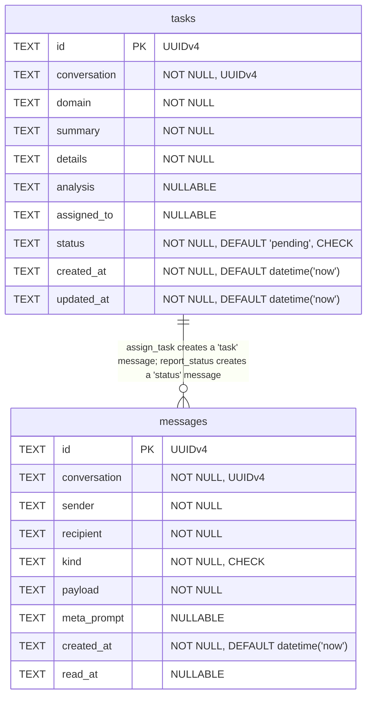

# Entity-Relationship Diagram -- MCP Bridge

## Relationships

There are no foreign-key constraints between `messages` and `tasks`. The relationship is enforced at the application layer:

- **assign_task** inserts one `tasks` row and one `messages` row (kind = `'task'`, payload contains `task_id`) inside a single transaction.
- **report_status** inserts one `messages` row (kind = `'status'`) and optionally updates the referenced `tasks` row (by `task_id`) inside a single transaction.
- Both tables share a `conversation` UUID that acts as a logical grouping key, but there is no FK constraint enforcing referential integrity.

---

### `messages`

Stores all inter-agent messages: context pushes, task notifications, status reports, and replies.

| Field | Type | Nullable | Notes |
|---|---|---|---|
| `id` | TEXT (UUIDv4) | NOT NULL | Primary key. Generated server-side via `crypto.randomUUID()`. |
| `conversation` | TEXT (UUIDv4) | NOT NULL | Groups messages into a logical conversation thread. |
| `sender` | TEXT | NOT NULL | Identifier of the sending agent (e.g. `"claude-code"`, `"codex"`). |
| `recipient` | TEXT | NOT NULL | Identifier of the receiving agent. |
| `kind` | TEXT | NOT NULL | Message type. **CHECK constraint:** must be one of `'context'`, `'task'`, `'status'`, `'reply'`. |
| `payload` | TEXT | NOT NULL | Free-form content. For kind `'task'`, this is a JSON object containing `task_id`, `domain`, `summary`, `details`. |
| `meta_prompt` | TEXT | Yes | Optional guidance for how the recipient should process the message. Only set on `'context'` messages. |
| `created_at` | TEXT (ISO 8601) | NOT NULL | Insertion timestamp. **DEFAULT:** `datetime('now')`. |
| `read_at` | TEXT (ISO 8601) | Yes | Set when the message is marked as read. `NULL` means unread. |

**Indexes:**

| Index Name | Columns | Purpose |
|---|---|---|
| `idx_messages_conversation` | `conversation` | Fast lookup of all messages in a conversation. |
| `idx_messages_recipient` | `recipient, read_at` | Fast lookup of unread messages for a given recipient (`WHERE recipient = ? AND read_at IS NULL`). |

**CHECK constraints:**

| Column | Constraint |
|---|---|
| `kind` | `kind IN ('context', 'task', 'status', 'reply')` |

---

### `tasks`

Stores task assignments with domain classification, implementation details, and lifecycle status.

| Field | Type | Nullable | Notes |
|---|---|---|---|
| `id` | TEXT (UUIDv4) | NOT NULL | Primary key. Generated server-side via `crypto.randomUUID()`. |
| `conversation` | TEXT (UUIDv4) | NOT NULL | Links this task to a conversation thread. |
| `domain` | TEXT | NOT NULL | Task domain classifier (e.g. `"frontend"`, `"backend"`, `"security"`). |
| `summary` | TEXT | NOT NULL | Brief one-line task summary. |
| `details` | TEXT | NOT NULL | Full implementation instructions. |
| `analysis` | TEXT | Yes | Analysis or research notes. Can be set at creation or updated via `report_status`. On status update, only overwritten if a new value is provided (`COALESCE(@analysis, analysis)`). |
| `assigned_to` | TEXT | Yes | Agent identifier the task is assigned to. `NULL` means unassigned. |
| `status` | TEXT | NOT NULL | Lifecycle state. **DEFAULT:** `'pending'`. **CHECK constraint:** must be one of `'pending'`, `'in_progress'`, `'completed'`, `'failed'`. |
| `created_at` | TEXT (ISO 8601) | NOT NULL | Insertion timestamp. **DEFAULT:** `datetime('now')`. |
| `updated_at` | TEXT (ISO 8601) | NOT NULL | Last-modified timestamp. **DEFAULT:** `datetime('now')`. Updated on every `updateTaskStatus` call. |

**Indexes:**

| Index Name | Columns | Purpose |
|---|---|---|
| `idx_tasks_conversation` | `conversation` | Fast lookup of all tasks in a conversation. |
| `idx_tasks_status` | `status` | Fast filtering by task lifecycle state. |

**CHECK constraints:**

| Column | Constraint |
|---|---|
| `status` | `status IN ('pending', 'in_progress', 'completed', 'failed')` |

---

---

### Derived View: ConversationSummary

Not a physical table — produced by `getConversations(limit, offset)` in `db/client.ts` using a `UNION ALL` aggregation query over both tables:

| Field | Source | Description |
|---|---|---|
| `conversation` | messages / tasks | UUID grouping key |
| `participants` | messages.sender + messages.recipient | Unique agent identifiers in the conversation |
| `message_count` | COUNT of messages rows | Total message volume |
| `task_count` | COUNT of tasks rows | Total task volume |
| `last_activity` | MAX(created_at) across both tables | Most recent event timestamp |

Results are ordered by `last_activity DESC` and support `limit` / `offset` pagination.

---

## Database Configuration

- **Engine:** SQLite via `better-sqlite3`
- **Journal mode:** WAL (`PRAGMA journal_mode = WAL`)
- **Foreign keys:** Enabled (`PRAGMA foreign_keys = ON`), though no FK constraints are currently defined
- **Default path:** `bridge.db` in the process working directory
