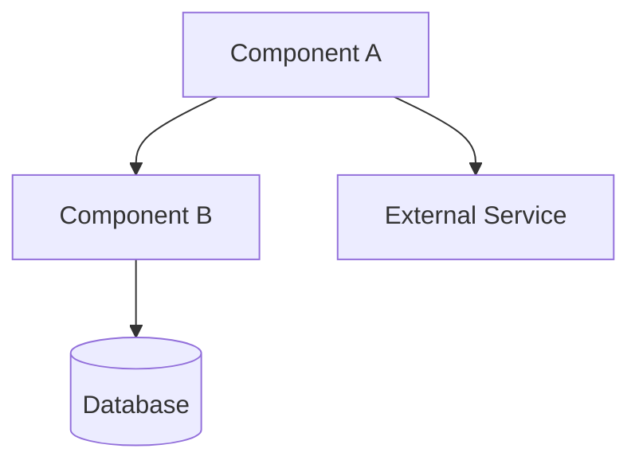
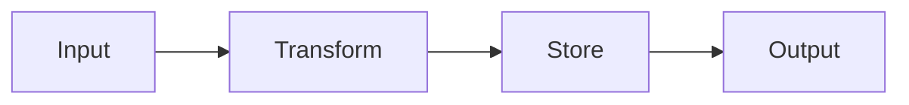
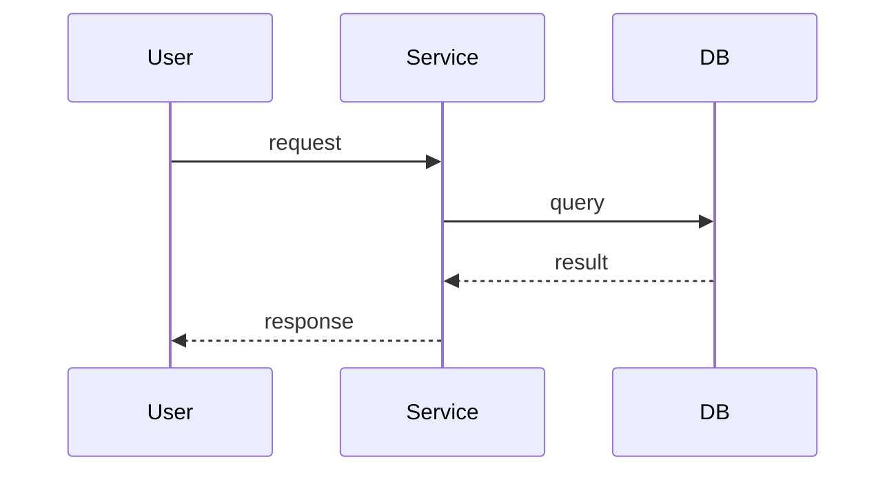

# Architecture Review — Engineering Lens

Reviews plans or implementations for technical soundness. Produces mandatory mermaid diagrams, edge case analysis, and a scored verdict.

> **Agentic Workflow** — 14 skills available. Run any as `/<name>`.
>
> | Skill | Purpose |
> |-------|---------|
> | `/review` | Multi-agent PR code review |
> | `/postReview` | Publish review findings to GitHub |
> | `/addressReview` | Implement review fixes in parallel |
> | `/enhancePrompt` | Context-aware prompt rewriter |
> | `/bootstrap` | Generate repo planning docs + CLAUDE.md |
> | `/rootCause` | 4-phase systematic debugging |
> | `/bugHunt` | Fix-and-verify loop with regression tests |
> | `/bugReport` | Structured bug report with health scores |
> | `/shipRelease` | Sync, test, push, open PR |
> | `/syncDocs` | Post-ship doc updater |
> | `/weeklyRetro` | Weekly retrospective with shipping streaks |
> | `/officeHours` | YC-style brainstorming → design doc |
> | `/productReview` | Founder/product lens plan review |
> | `/archReview` | Engineering architecture plan review |
>
> **Output directory:** `~/.agentic-workflow/<repo-slug>/`

## Preamble — Bootstrap Check

Before running this skill, verify the environment is set up:

```bash
# Derive repo slug
REMOTE_URL=$(git remote get-url origin 2>/dev/null || echo "")
if [ -n "$REMOTE_URL" ]; then
  REPO_SLUG=$(echo "$REMOTE_URL" | sed 's|.*[:/]\([^/]*/[^/]*\)\.git$|\1|;s|.*[:/]\([^/]*/[^/]*\)$|\1|' | tr '/' '-')
else
  REPO_SLUG=$(basename "$(pwd)")
fi
echo "repo-slug: $REPO_SLUG"

# Check bootstrap status
SKILLS_OK=true
for s in review postReview addressReview enhancePrompt bootstrap rootCause bugHunt bugReport shipRelease syncDocs weeklyRetro officeHours productReview archReview; do
  [ -d "$HOME/.claude/skills/$s" ] || SKILLS_OK=false
done

BRIDGE_OK=false
[ -f "$(dirname "$(readlink -f "$HOME/.claude/skills/review/SKILL.md" 2>/dev/null || echo /dev/null)")/../mcp-bridge/dist/mcp.js" ] 2>/dev/null && BRIDGE_OK=true

echo "skills-symlinked: $SKILLS_OK"
echo "bridge-built: $BRIDGE_OK"
```

If either check fails, ask the user via AskUserQuestion:
> "Agentic Workflow is not fully set up. Run setup.sh now? (yes/no)"

If **yes**: run `bash <path-to-agentic-workflow>/setup.sh` (resolve path from the review skill symlink target).
If **no**: warn that some features may not work, then continue.

Create the output directory for this repo:
```bash
mkdir -p "$HOME/.agentic-workflow/$REPO_SLUG"
mkdir -p "$HOME/.agentic-workflow/$REPO_SLUG/plans"
```

---

## Step 1: Resolve the Target

**If a file path is given**, read that file as the plan/spec to review.

**If a directory is given**, explore its structure using Glob and Read to understand the implementation.

**If nothing is given**, try two fallbacks in order:
1. Find the most recent plan in `$HOME/.agentic-workflow/$REPO_SLUG/plans/`:
   ```bash
   ls -t "$HOME/.agentic-workflow/$REPO_SLUG/plans/"*.md 2>/dev/null | head -1
   ```
2. If no plans exist, review the current project's architecture by exploring the repository root.

## Step 2: Read Context

Read all available architectural context:

- `CLAUDE.md` — project conventions and structure
- `planning/ARCHITECTURE.md` or `ARCHITECTURE.md` — existing architecture docs
- `planning/ERD.md` or `ERD.md` — data model
- `planning/API_CONTRACT.md` or `API_CONTRACT.md` — API surface
- `README.md` — project overview

Use Glob to discover these files -- do not assume paths.

## Step 3: Architecture Analysis

Spawn an **Agent** with task "Explore" to map the system:

The agent should investigate and report on:

- **Component boundaries** — What are the distinct modules/services? Where are the boundaries drawn?
- **Dependency graph** — What depends on what? Are there circular dependencies?
- **Data flow paths** — How does data enter, transform, and exit the system?
- **External integrations** — What third-party services, APIs, or tools are involved?
- **State management** — Where is state stored? How is it synchronized? What is the source of truth?
- **Error propagation** — How do errors flow across boundaries? Are they handled or swallowed?

The agent should read source files, configuration, and package manifests to build an accurate picture.

## Step 4: Generate Mandatory Diagrams

Create three mermaid diagrams. These are **mandatory** -- the review is incomplete without them.

### 4a: Component Diagram

Show each module/service as a box with dependency arrows. Include:
- Internal components and their responsibilities
- External dependencies (databases, APIs, file system)
- Direction of dependency (who depends on whom)



### 4b: Data Flow Diagram

Show how data moves through the system from entry to exit:
- Input sources (user, API, file, event)
- Transformation steps
- Storage points
- Output destinations



### 4c: Sequence Diagram

Model the single most critical user flow end-to-end:
- All participants (user, services, databases)
- Request/response pairs
- Error paths for the main flow



## Step 5: Edge Case Analysis

For **each component boundary** identified in Step 3, analyze these four failure modes:

### 5a: Dependency Unavailable
- What happens when each external dependency is unreachable?
- Is there a timeout? A retry? A fallback?
- Does the failure cascade or is it contained?

### 5b: Invalid / Malicious Input
- What happens with unexpected types, missing fields, oversized payloads?
- Is input validated at the boundary or deep inside?
- Are there injection vectors (SQL, command, path traversal)?

### 5c: Load Stress (10x)
- What happens at 10x the expected request volume?
- Where is the first bottleneck (CPU, memory, I/O, connections)?
- Are there unbounded queues, caches, or buffers?

### 5d: State Leakage
- Can state from one request/user leak into another?
- Are there shared mutable globals?
- Is cleanup guaranteed (connections, file handles, temp files)?

## Step 6: Review Verdict

Produce the final assessment:

```markdown
# Architecture Review: {title}

_Reviewed by `/archReview` on {ISO date}_

## Verdict: {SOUND | NEEDS WORK | REDESIGN}

{One paragraph justification}

## Scores

| Dimension | Score (1-10) | Notes |
|-----------|:---:|-------|
| Complexity | {n} | {brief justification} |
| Scalability | {n} | {brief justification} |
| Maintainability | {n} | {brief justification} |

## Component Diagram

{mermaid diagram from 4a}

## Data Flow Diagram

{mermaid diagram from 4b}

## Sequence Diagram

{mermaid diagram from 4c}

## Top Risks

| # | Risk | Impact | Likelihood | Mitigation |
|---|------|--------|------------|------------|
| 1 | {risk} | {high/med/low} | {high/med/low} | {recommendation} |
| 2 | {risk} | {high/med/low} | {high/med/low} | {recommendation} |
| ... | ... | ... | ... | ... |

## Edge Case Findings

### Dependency Failures
{findings from 5a}

### Input Validation Gaps
{findings from 5b}

### Load Concerns
{findings from 5c}

### State Leakage Risks
{findings from 5d}

## Missing Error Handling
- {specific location and what's missing}
- {specific location and what's missing}

## Suggested Improvements (Prioritized)

| Priority | Improvement | Effort | Impact |
|----------|------------|--------|--------|
| P0 | {must fix before shipping} | {S/M/L} | {description} |
| P1 | {should fix soon} | {S/M/L} | {description} |
| P2 | {nice to have} | {S/M/L} | {description} |
```

## Step 7: Write the Review

Generate a URL-safe slug from the target title (lowercase, hyphens, no special chars). Write the file:

```bash
TIMESTAMP=$(date +%Y%m%d-%H%M%S)
```

Write to: `$HOME/.agentic-workflow/$REPO_SLUG/plans/{timestamp}-arch-review-{slug}.md`

Include all three mermaid diagrams and the complete analysis.

## Step 8: Report

Show a summary to the user:

```
Architecture Review complete!

Verdict: {SOUND | NEEDS WORK | REDESIGN}

Scores:
  Complexity:      {n}/10
  Scalability:     {n}/10
  Maintainability: {n}/10

Review written to: ~/.agentic-workflow/{repo-slug}/plans/{timestamp}-arch-review-{slug}.md

Top 3 risks:
  1. {risk summary}
  2. {risk summary}
  3. {risk summary}

Suggested next steps:
  /productReview — Get founder-lens feedback on the plan
  /officeHours — Brainstorm solutions to identified risks
```
