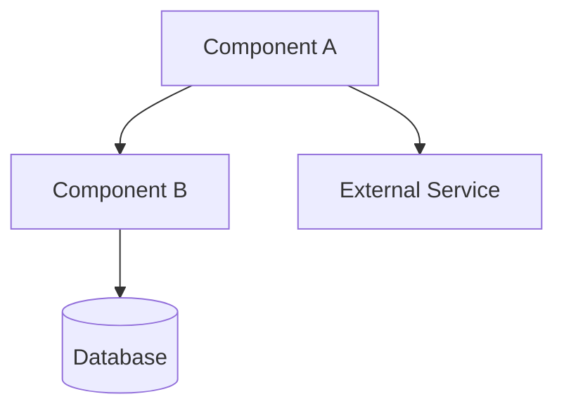
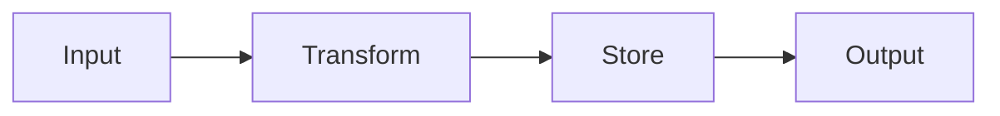
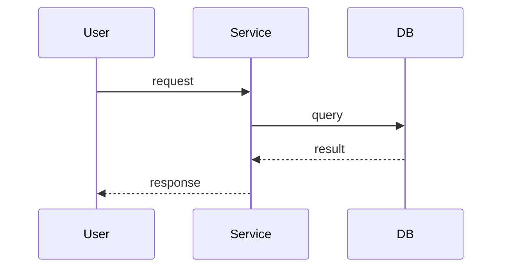

# Architecture Review — Engineering Lens

Reviews plans or implementations for technical soundness. Produces mandatory mermaid diagrams, edge case analysis, and a scored verdict.

<!-- === PREAMBLE START === -->

> **Agentic Workflow** — 34 skills available. Run any as `/<name>`.
>
> | Skill | Purpose |
> |-------|---------|
> | `/review` | Multi-agent PR code review |
> | `/postReview` | Publish review findings to GitHub |
> | `/addressReview` | Implement review fixes in parallel |
> | `/enhancePrompt` | Context-aware prompt rewriter |
> | `/bootstrap` | Generate repo planning docs + CLAUDE.md |
> | `/rootCause` | 4-phase systematic debugging |
> | `/bugHunt` | Fix-and-verify loop with regression tests |
> | `/bugReport` | Structured bug report with health scores |
> | `/shipRelease` | Sync, test, push, open PR |
> | `/syncDocs` | Post-ship doc updater |
> | `/weeklyRetro` | Weekly retrospective with shipping streaks |
> | `/officeHours` | Spec-driven brainstorming → EARS requirements + design doc |
> | `/productReview` | Founder/product lens plan review |
> | `/archReview` | Engineering architecture plan review |
> | `/design-analyze` | Detect web vs iOS, extract design tokens (dispatcher) |
> | `/design-analyze-web` | Extract design tokens from reference URLs (web) |
> | `/design-analyze-ios` | Extract design tokens from Swift/Xcode assets |
> | `/design-language` | Define brand personality and aesthetic direction |
> | `/design-evolve` | Detect web vs iOS, merge new reference into design language (dispatcher) |
> | `/design-evolve-web` | Merge new URL into design language (web) |
> | `/design-evolve-ios` | Merge Swift reference into design language (iOS) |
> | `/design-mockup` | Detect web vs iOS, generate mockup (dispatcher) |
> | `/design-mockup-web` | Generate HTML mockup from design language |
> | `/design-mockup-ios` | Generate SwiftUI preview mockup |
> | `/design-implement` | Detect web vs iOS, generate production code (dispatcher) |
> | `/design-implement-web` | Generate web production code (CSS/Tailwind/Next.js) |
> | `/design-implement-ios` | Generate SwiftUI components from design tokens |
> | `/design-refine` | Dispatch Impeccable refinement commands |
> | `/design-verify` | Detect web vs iOS, screenshot diff vs mockup (dispatcher) |
> | `/design-verify-web` | Playwright screenshot diff vs mockup (web) |
> | `/design-verify-ios` | Simulator screenshot diff vs mockup (iOS) |
> | `/verify-app` | Detect web vs iOS, verify running app (dispatcher) |
> | `/verify-web` | Playwright browser verification of running web app |
> | `/verify-ios` | XcodeBuildMCP simulator verification of iOS app |
>
> **Output directory:** `~/.agentic-workflow/<repo-slug>/`

## Codebase Navigation

Prefer **Serena** for all code exploration — LSP-based symbol lookup is faster and more precise than file scanning.

| Task | Tool |
|------|------|
| Find a function, class, or symbol | `serena: find_symbol` |
| What references symbol X? | `serena: find_referencing_symbols` |
| Module/file structure overview | `serena: get_symbols_overview` |
| Search for a string or pattern | `Grep` (fallback) |
| Read a full file | `Read` (fallback) |

## Preamble — Bootstrap Check

Before running this skill, verify the environment is set up:

```bash
# Derive repo slug
REMOTE_URL=$(git remote get-url origin 2>/dev/null || echo "")
if [ -n "$REMOTE_URL" ]; then
  REPO_SLUG=$(echo "$REMOTE_URL" | sed 's|.*[:/]\([^/]*/[^/]*\)\.git$|\1|;s|.*[:/]\([^/]*/[^/]*\)$|\1|' | tr '/' '-')
else
  REPO_SLUG=$(basename "$(pwd)")
fi
echo "repo-slug: $REPO_SLUG"

# Check bootstrap status
SKILLS_OK=true
for s in review postReview addressReview enhancePrompt bootstrap rootCause bugHunt bugReport shipRelease syncDocs weeklyRetro officeHours productReview archReview design-analyze design-analyze-web design-analyze-ios design-language design-evolve design-evolve-web design-evolve-ios design-mockup design-mockup-web design-mockup-ios design-implement design-implement-web design-implement-ios design-refine design-verify design-verify-web design-verify-ios verify-app verify-web verify-ios; do
  [ -d "$HOME/.claude/skills/$s" ] || SKILLS_OK=false
done

BRIDGE_OK=false
lsof -i TCP:3100 -sTCP:LISTEN &>/dev/null && BRIDGE_OK=true

RULES_OK=false
[ -d ".claude/rules" ] && [ -n "$(ls -A .claude/rules/ 2>/dev/null)" ] && RULES_OK=true

echo "skills-symlinked: $SKILLS_OK"
echo "bridge-running: $BRIDGE_OK"
echo "rules-directory: $RULES_OK"
```

Domain rules in `.claude/rules/` load automatically per glob — no action needed if `rules-directory: true`.

If `SKILLS_OK=false` or `BRIDGE_OK=false`, ask the user via AskUserQuestion:
> "Agentic Workflow is not fully set up. Run setup.sh now? (yes/no)"

If **yes**: run `bash <path-to-agentic-workflow>/setup.sh` (resolve path from the review skill symlink target).
If **no**: warn that some features may not work, then continue.

If `RULES_OK=false` (and `SKILLS_OK` and `BRIDGE_OK` are both true), do not offer setup.sh. Instead, show:
> "Domain rules not found — run `/bootstrap` to generate `.claude/rules/` for this repo."

Create the output directory for this repo:
```bash
mkdir -p "$HOME/.agentic-workflow/$REPO_SLUG"
```

## Memory Recall

> **Skip if** this skill is marked `<!-- MEMORY: SKIP -->`, or if `BRIDGE_OK=false`.

Check for prior discussion context in memory before reading the codebase.

**1. Derive a topic string** — synthesize 3–5 words from the skill argument and task intent:
- `/officeHours add dark mode` → `"dark mode UI feature"`
- `/rootCause TypeError cannot read properties` → `"TypeError cannot read properties"`
- `/review 42` → use the PR title once fetched: `"PR {title} review"`
- No argument → use the most specific descriptor available: `"{REPO_SLUG} {skill-name}"`

**2. Search memory:**
```
mcp__agentic-bridge__search_memory — query: <topic>, repo: REPO_SLUG, mode: "hybrid", limit: 10
```

**3. Assemble context:**
```
mcp__agentic-bridge__get_context — query: <topic>, repo: REPO_SLUG, token_budget: 2000
```
(Use `token_budget: 1000` for `/review` and `/addressReview`.)

**4. Surface results:**
- If `get_context` returns a non-empty summary or any section with `relevance > 0.3`:
  > **Prior context:** {summary} *(~{token_estimate} tokens)*
  Use this to inform your approach before continuing.
- If empty, all low-relevance, or any tool error: continue silently — do not mention the search.

<!-- === PREAMBLE END === -->

## Step 1: Resolve the Target

**If a file path is given**, read that file as the plan/spec to review.

**If a directory is given**, explore its structure using Glob and Read to understand the implementation.

**If nothing is given**, try two fallbacks in order:
1. Find the most recent plan in `$HOME/.agentic-workflow/$REPO_SLUG/plans/`. Plans may be either a directory (new SDD format with `requirements.md`, `design.md`, `TASKS.md`) or a single `.md` file (legacy format). Check both and prefer whichever is newest:
   ```bash
   # Find newest plan directory (SDD format) and newest plan file (legacy format)
   NEWEST_DIR=$(ls -dt "$HOME/.agentic-workflow/$REPO_SLUG/plans/"*/ 2>/dev/null | head -1)
   NEWEST_FILE=$(ls -t "$HOME/.agentic-workflow/$REPO_SLUG/plans/"*.md 2>/dev/null | head -1)

   # Compare timestamps -- prefer whichever is more recent
   if [ -n "$NEWEST_DIR" ] && [ -n "$NEWEST_FILE" ]; then
     if [ "$NEWEST_DIR" -nt "$NEWEST_FILE" ]; then
       PLAN_TARGET="$NEWEST_DIR"
     else
       PLAN_TARGET="$NEWEST_FILE"
     fi
   elif [ -n "$NEWEST_DIR" ]; then
     PLAN_TARGET="$NEWEST_DIR"
   elif [ -n "$NEWEST_FILE" ]; then
     PLAN_TARGET="$NEWEST_FILE"
   fi
   ```
   If `PLAN_TARGET` is a directory, explore its structure using Glob and Read to review all three files (`requirements.md`, `design.md`, `TASKS.md`). If it is a single file, read it as before.
2. If no plans exist, review the current project's architecture by exploring the repository root.

## Step 2: Read Context

Read all available architectural context:

- `CLAUDE.md` — project conventions and structure
- `planning/ARCHITECTURE.md` or `ARCHITECTURE.md` — existing architecture docs
- `planning/ERD.md` or `ERD.md` — data model
- `planning/API_CONTRACT.md` or `API_CONTRACT.md` — API surface
- `README.md` — project overview

Use Glob to discover these files -- do not assume paths.

## Step 3: Architecture Analysis

Spawn an **Agent** with task "Explore" to map the system:

The agent should investigate and report on:

- **Component boundaries** — What are the distinct modules/services? Where are the boundaries drawn?
- **Dependency graph** — What depends on what? Are there circular dependencies?
- **Data flow paths** — How does data enter, transform, and exit the system?
- **External integrations** — What third-party services, APIs, or tools are involved?
- **State management** — Where is state stored? How is it synchronized? What is the source of truth?
- **Error propagation** — How do errors flow across boundaries? Are they handled or swallowed?

The agent should read source files, configuration, and package manifests to build an accurate picture.

## Step 4: Generate Mandatory Diagrams

Create three mermaid diagrams. These are **mandatory** -- the review is incomplete without them.

### 4a: Component Diagram

Show each module/service as a box with dependency arrows. Include:
- Internal components and their responsibilities
- External dependencies (databases, APIs, file system)
- Direction of dependency (who depends on whom)



### 4b: Data Flow Diagram

Show how data moves through the system from entry to exit:
- Input sources (user, API, file, event)
- Transformation steps
- Storage points
- Output destinations



### 4c: Sequence Diagram

Model the single most critical user flow end-to-end:
- All participants (user, services, databases)
- Request/response pairs
- Error paths for the main flow



## Step 5: Edge Case Analysis

For **each component boundary** identified in Step 3, analyze these four failure modes:

### 5a: Dependency Unavailable
- What happens when each external dependency is unreachable?
- Is there a timeout? A retry? A fallback?
- Does the failure cascade or is it contained?

### 5b: Invalid / Malicious Input
- What happens with unexpected types, missing fields, oversized payloads?
- Is input validated at the boundary or deep inside?
- Are there injection vectors (SQL, command, path traversal)?

### 5c: Load Stress (10x)
- What happens at 10x the expected request volume?
- Where is the first bottleneck (CPU, memory, I/O, connections)?
- Are there unbounded queues, caches, or buffers?

### 5d: State Leakage
- Can state from one request/user leak into another?
- Are there shared mutable globals?
- Is cleanup guaranteed (connections, file handles, temp files)?

## Step 6: Review Verdict

Produce the final assessment:

```markdown
# Architecture Review: {title}

_Reviewed by `/archReview` on {ISO date}_

## Verdict: {SOUND | NEEDS WORK | REDESIGN}

{One paragraph justification}

## Scores

| Dimension | Score (1-10) | Notes |
|-----------|:---:|-------|
| Complexity | {n} | {brief justification} |
| Scalability | {n} | {brief justification} |
| Maintainability | {n} | {brief justification} |

## Component Diagram

{mermaid diagram from 4a}

## Data Flow Diagram

{mermaid diagram from 4b}

## Sequence Diagram

{mermaid diagram from 4c}

## Top Risks

| # | Risk | Impact | Likelihood | Mitigation |
|---|------|--------|------------|------------|
| 1 | {risk} | {high/med/low} | {high/med/low} | {recommendation} |
| 2 | {risk} | {high/med/low} | {high/med/low} | {recommendation} |
| ... | ... | ... | ... | ... |

## Edge Case Findings

### Dependency Failures
{findings from 5a}

### Input Validation Gaps
{findings from 5b}

### Load Concerns
{findings from 5c}

### State Leakage Risks
{findings from 5d}

## Missing Error Handling
- {specific location and what's missing}
- {specific location and what's missing}

## Suggested Improvements (Prioritized)

| Priority | Improvement | Effort | Impact |
|----------|------------|--------|--------|
| P0 | {must fix before shipping} | {S/M/L} | {description} |
| P1 | {should fix soon} | {S/M/L} | {description} |
| P2 | {nice to have} | {S/M/L} | {description} |
```

## Step 7: Write the Review

Generate a URL-safe slug from the target title (lowercase, hyphens, no special chars). Write the file:

```bash
TIMESTAMP=$(date +%Y%m%d-%H%M%S)
```

Write to: `$HOME/.agentic-workflow/$REPO_SLUG/plans/{timestamp}-arch-review-{slug}.md`

Include all three mermaid diagrams and the complete analysis.

## Step 8: Report

Show a summary to the user:

```
Architecture Review complete!

Verdict: {SOUND | NEEDS WORK | REDESIGN}

Scores:
  Complexity:      {n}/10
  Scalability:     {n}/10
  Maintainability: {n}/10

Review written to: ~/.agentic-workflow/{repo-slug}/plans/{timestamp}-arch-review-{slug}.md

Top 3 risks:
  1. {risk summary}
  2. {risk summary}
  3. {risk summary}

Suggested next steps:
  /productReview — Get founder-lens feedback on the plan
  /officeHours — Brainstorm solutions to identified risks
```
